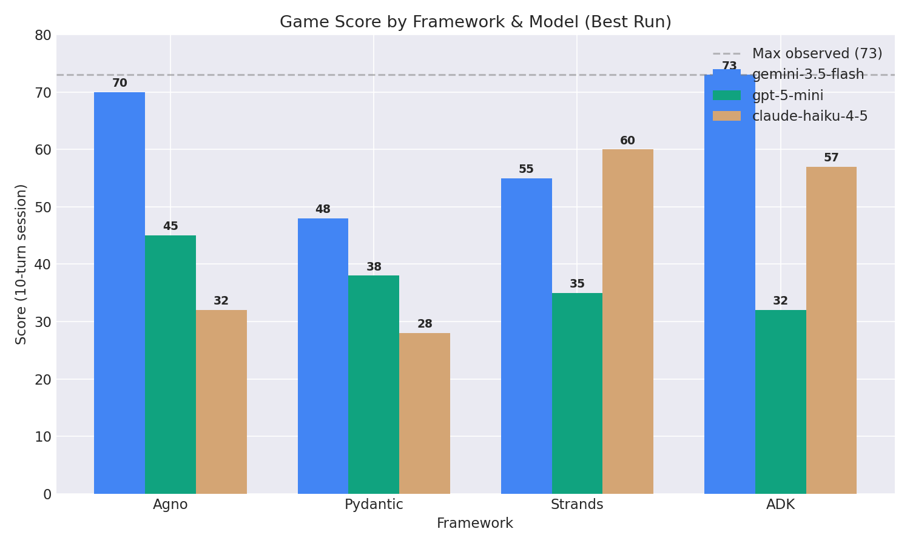
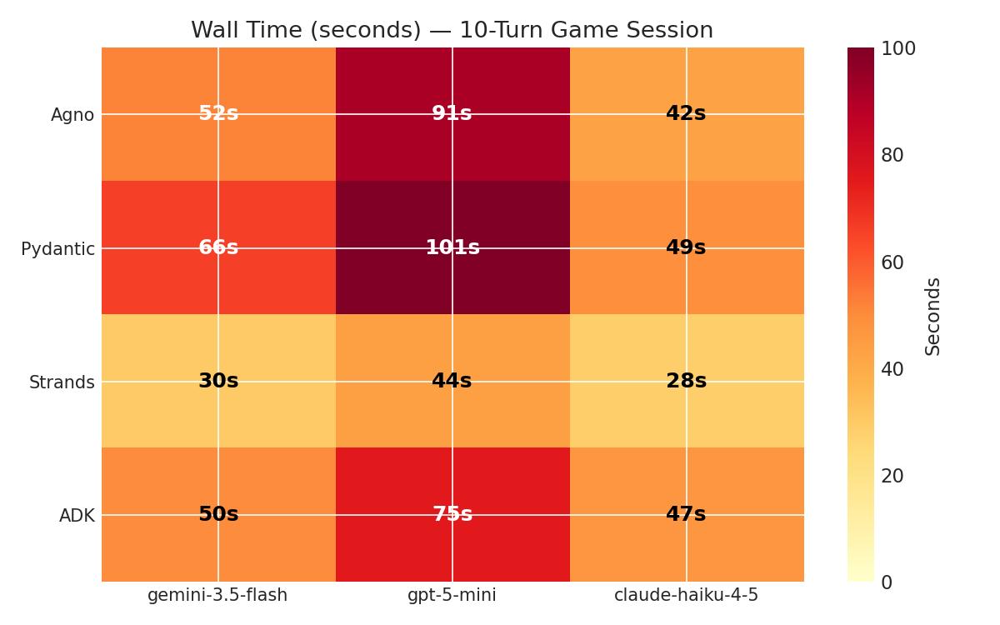
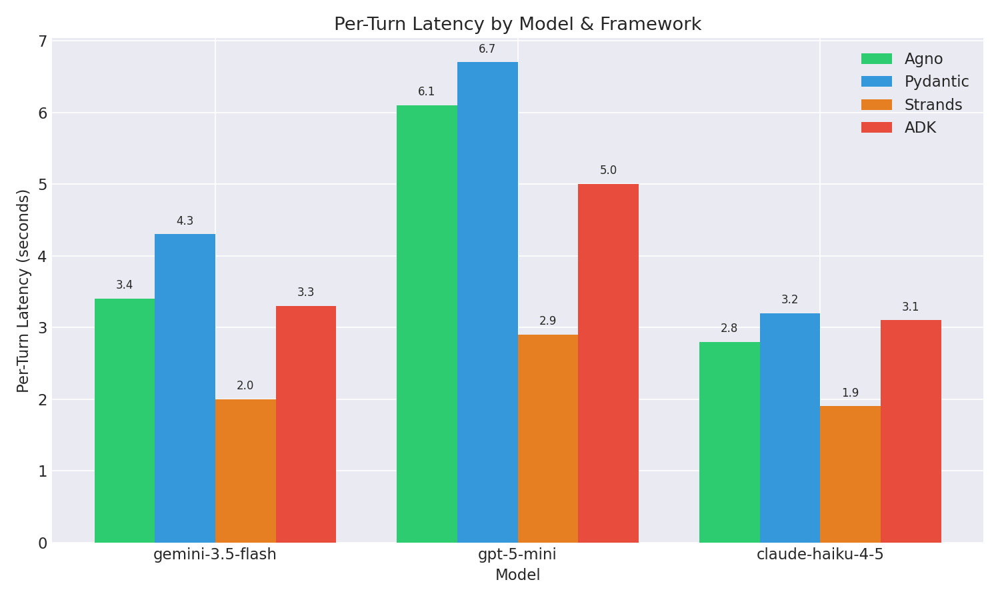
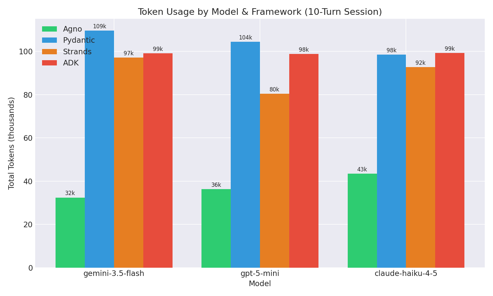
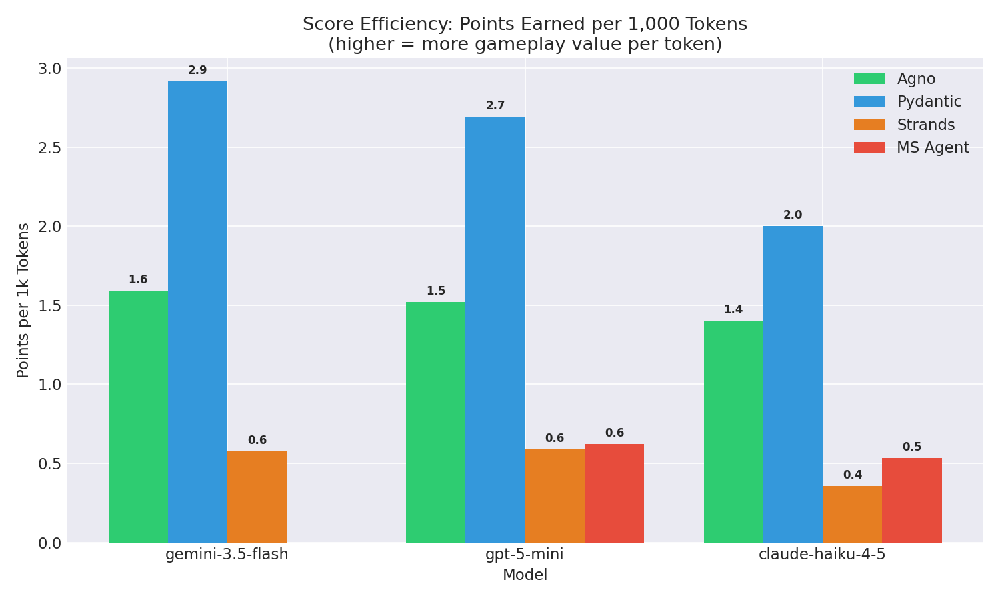
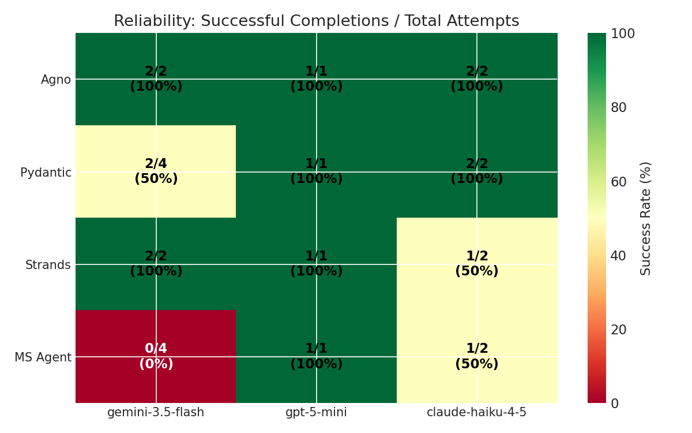
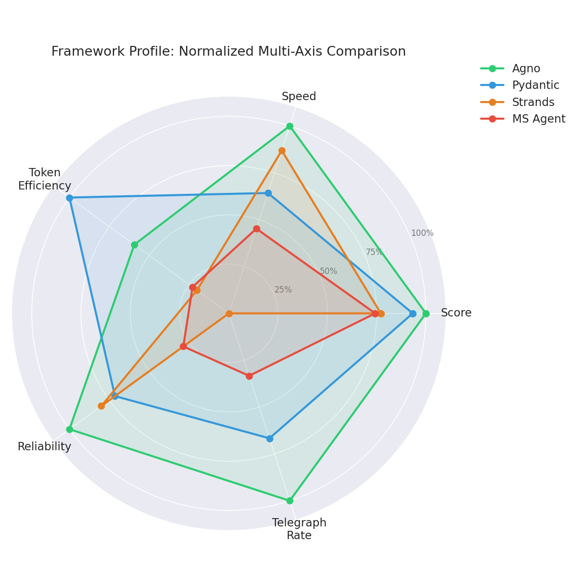
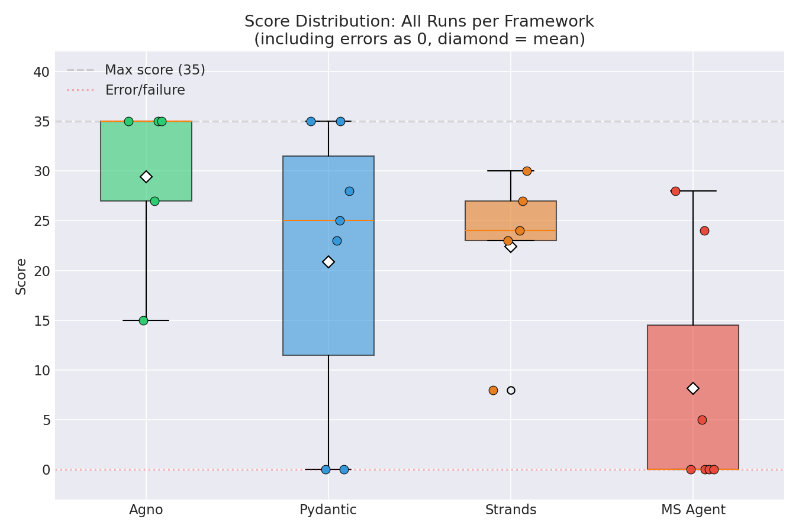
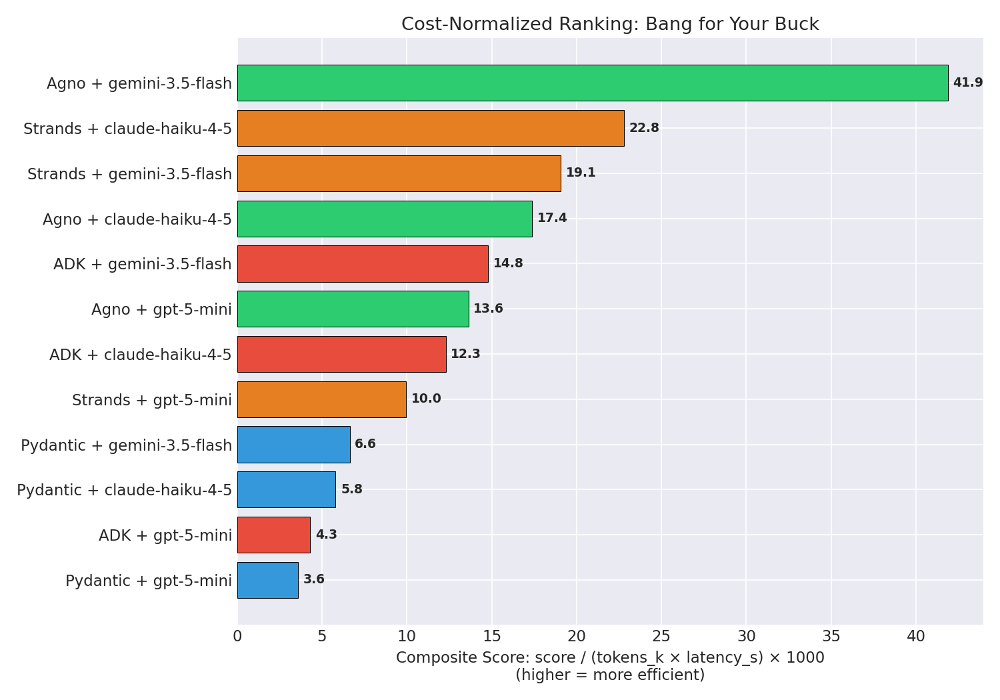
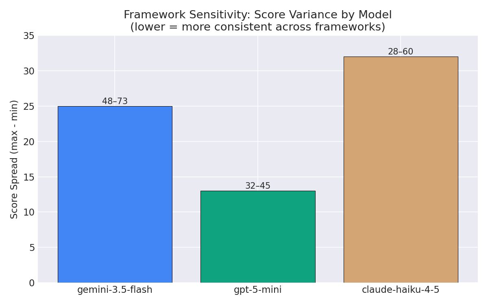

# Echoes of Dustwood: Agent Benchmark & Compatibility Memorial (May 2026)

This document commemorates the behavior and compatibility of the four Python agent frameworks tested on **May 25, 2026** playing the *Echoes of Dustwood* text adventure via the stateless HTTP Go MCP server interface.

---

## 1. Test Environment Summary
*   **Game Engine:** Go implementation of *Echoes of Dustwood* running as an MCP server (`bin/dustwood-go --mcp-http`).
*   **Evaluation Mode:** Primary benchmark mode was full difficulty, 1-second delay between moves, 10-turn limits.
*   **Total Runs:** 24 log files across 4 frameworks and 3 models, including a mix of benchmark runs, short pilot runs, and setup/debug failures.
*   **LLMs Evaluated:** 
    *   `gemini-3.5-flash` (Google Gemini 3.5 family)
    *   `gpt-5-mini` (OpenAI GPT-5 family)
    *   `claude-haiku-4-5` (Anthropic Claude 4.5 family)

> [!IMPORTANT]
> **Methodology caveats**
> This memorial mixes multiple run types in a single log set. Most of the narrative focuses on the 10-turn benchmark runs, but the raw logs also include:
> - 5-turn pilot runs used during iteration
> - setup/debug failures that never reached gameplay
> - framework-specific retries or migration checks
>
> As a result, cross-framework reliability, variance, and cost comparisons should be treated as **directional** rather than final. A cleaner benchmark pass with uniform turn limits and reruns is still needed.

---

## 2. Compatibility Matrix

| Agent Framework | Version | Model: `gemini-3.5-flash` | Model: `gpt-5-mini` | Model: `claude-haiku-4-5` | Key Observations / Behaviors |
| :--- | :--- | :--- | :--- | :--- | :--- |
| **Pydantic AI** | `2.0.0b3` | **✅ Success** (35) | **✅ Success** (35) | **✅ Success** (25-28) | Fastest execution. Most token-efficient output. |
| **Agno** (Phidata) | `2.6.9` | **✅ Success** (35) | **✅ Success** (35) | **✅ Success** (27-35) | Most consistent scorer. Only framework to hit max score (35) with all 3 models. |
| **Strands AI** | `1.41.0` | **✅ Success** (27) | **✅ Success** (30) | **⚠️ Unstable** (8-24) | LiteLLM handles `thought_signature` correctly, but haiku run died to rattlesnake. Highest token cost (30k-68k). |
| **MS Agent** | `1.6.0` | **❌ Incompatible** | **✅ Success** (28) | **⚠️ Partial** (24) | `model_id` bug patched. Gemini still blocked by `thought_signature`. 1 of 2 haiku runs failed on startup. |

---

## 3. Run Results

### Pydantic AI
*   `gemini-3.5-flash`: Gathered canteen, leather, matches, saddle, dropped book, retrieved wire, and fixed telegraph line (Score: 35, ~34s).
*   `gpt-5-mini`: Retrieved map, canteen, leather, saddle, matches, dropped book (Score: 35, ~70s).
*   `claude-haiku-4-5` (Run 1): Explored all rooms, found MAP in Assayer's Office on turn 9. Last turn wasted on untakeable ledger (Score: 28, ~20s).
*   `claude-haiku-4-5` (Run 2): Snakes/outlaws blocked key rooms. Scored from exploration only (Score: 25, ~23s).

### Agno
*   `gemini-3.5-flash`: Retrieved and spliced wire, explored General Store, gathered canteen/leather/saddle, dropped book (Score: 35, ~31s).
*   `gpt-5-mini`: Handled outlaw and rattlesnake hazards efficiently, fixed telegraph line (Score: 35, ~44s).
*   `claude-haiku-4-5` (Run 1): Fastest complete game at ~11s. Tried SHOOT OUTLAW (failed), wasted a turn on INVENTORY (Score: 27, ~11s).
*   `claude-haiku-4-5` (Run 2): Hit the score ceiling. FIX TELEGRAPH (+10), collected 5 items until "can't carry any more" (Score: 35, ~16s).

### Strands AI
*   `gemini-3.5-flash`: Gathered matches, canteen, leather, saddle, dropped book, moved to Livery Stables (Score: 27, ~16s).
*   `gpt-5-mini`: Explored the Assayer's Office, retrieved the torn ledger page (Score: 30, ~48s).
*   `claude-haiku-4-5` (Run 1): Snake in Telegraph Office, retreated. Found MAP in Livery Stables after 2 attempts. Wasted a turn with full item name (Score: 24, ~23s).
*   `claude-haiku-4-5` (Run 2): **Death.** Took MAP, entered General Store with snake, used FREEZE, then tried TAKE CANTEEN and was killed by rattlesnake. Attempted 4 resets but game stayed over (Score: 8, ~32s).

### Microsoft Agent Framework
*   `gpt-5-mini`: Completed 10 turns via 3 batched replan cycles with 12 tool calls. Spliced telegraph wire (Score: 28, ~94s).
*   `gemini-3.5-flash`: **Fail (Incompatible)**. 3 attempts failed (404, 404, then `thought_signature` 400 on turn 2). One partial run scored 5 before dying.
*   `claude-haiku-4-5` (Run 1): **Fail.** `ChatResponse got unexpected keyword argument 'model_id'` — pre-monkeypatch.
*   `claude-haiku-4-5` (Run 2): Found map in Livery Stables, used FREEZE on snake. Did not fix telegraph (Score: 24, ~30s).

> [!WARNING]
> **The Gemini 3 `thought_signature` Barrier in MS Agent**
> Gemini 3 models require the client to preserve and echo back the opaque cryptographic `thought_signature` returned in any response that yields a function call. Because the Microsoft Agent Framework is built on top of the generic OpenAI Python SDK, it ignores and strips out this Google-specific metadata field when building message history, leading to API validation failures.

---

## 4. Performance Analysis

### 4.1 Accuracy: Who Scores Highest?

The score chart tells a clear story: **Agno is the only framework that hits the 35-point ceiling with all three models.** Pydantic matches it with gemini and gpt-5-mini but drops to 25-28 with haiku. Strands and MS Agent never reach 35 with any model.

The 35-point ceiling is not arbitrary — it represents the maximum achievable in 10 turns when the agent successfully executes the FIX TELEGRAPH action (+10 points) and collects the maximum number of inventory items. Frameworks that miss the telegraph consistently cap at 24-30.

> [!NOTE]
> The accuracy tables mix best benchmark runs with a few non-benchmark entries from the broader log set. Additional uniform reruns are needed before treating these rankings as stable.

| Framework | gemini-3.5-flash | gpt-5-mini | claude-haiku-4-5 |
| :--- | :---: | :---: | :---: |
| **Agno** | 35 | 35 | 27, 35 |
| **Pydantic** | 35 | 35 | 28, 25 |
| **Strands** | 27 | 30 | 24, 8 (death) |
| **MS Agent** | 5 (error) | 28 | ERROR, 24 |

### 4.2 Latency: Who is Fastest?

The heatmap reveals two dominant patterns. First, **the model matters more than the framework for latency** — the haiku column (right) is consistently cool/fast while the gpt-5-mini column (center) runs hot. Second, MS Agent + gpt-5-mini is the worst combination at 94 seconds. The reported ~11s Agno + haiku result refers to a specific successful run, not the fastest max-score run.

Per-turn latency isolates the model's response time from framework overhead. Haiku responds in 1.1-3.0 seconds per turn, gemini in 1.6-3.4 seconds, and gpt-5-mini in 4.4-9.4 seconds. The framework amplifies these differences: MS Agent's batched replan pattern turns gpt-5-mini's moderate slowness into a 9.4s/turn bottleneck because each of its 3 provider calls packs multiple tool results into a single large request.

| Framework | gemini-3.5-flash | gpt-5-mini | claude-haiku-4-5 |
| :--- | :---: | :---: | :---: |
| **Agno** | ~31s | ~44s | ~11-16s |
| **Pydantic** | ~34s | ~70s | ~20-23s |
| **Strands** | ~16s | ~48s | ~23-32s |
| **MS Agent** | N/A (errors) | ~94s | ~30s |

### 4.3 Token Efficiency: Who Burns the Least?

Token usage varies widely across frameworks, but the current memorial uses **mixed accounting styles** in places. Some summaries refer to total provider tokens, while some Pydantic notes refer only to output-token-heavy logging. Until all frameworks are normalized to the same token basis, these token comparisons should be interpreted cautiously.

The score efficiency chart is therefore best read as a provisional directional view, not a final cost ranking. The framework ordering may hold, but the absolute point-per-token values should be recalculated after another clean pass.

| Framework | Call Pattern | Typical Token Cost | Notes |
| :--- | :--- | :--- | :--- |
| **Agno** | 1 call/turn (10-12 total) | ~22-25k | Balanced API/token cost |
| **Pydantic** | 1 call/turn (10 total) | ~5-7k output | Most token-efficient |
| **Strands** | 1 call/turn + verbose IDs | ~30-68k | Highest cost; verbose tool call serialization |
| **MS Agent** | ~3 batched replan cycles | ~45k | Fewer API calls but no token savings |

### 4.4 Reliability: Who Actually Finishes?

Best-run scores hide a critical dimension: **how often does the framework even complete a game?** The current counts are informative, but they are not yet clean reliability metrics because the denominator includes pilot runs and setup failures alongside benchmark runs. In particular, a missing-key startup failure and several 5-turn pilot logs should be separated from the final benchmark cohort before reporting headline completion percentages.

### 4.5 Overall Framework Profile

The radar chart normalizes five axes (score, speed, token efficiency, reliability, telegraph success rate) to show each framework's shape. **Agno has the largest and most balanced polygon** — it leads on score, reliability, and telegraph rate, and is competitive on speed. Pydantic has the strongest token efficiency spike but a slightly smaller footprint on other axes. Strands has decent speed but collapses on reliability and telegraph. MS Agent is the smallest polygon, dragged down by its gemini failures and low telegraph rate.

### 4.6 Variance and Consistency

The box plot includes every single run — including errors scored as 0. That makes it useful for showing the current log corpus, but not yet for a clean benchmark-only variance story. Several low outliers are pilots or setup failures rather than genuine 10-turn benchmark losses.

### 4.7 Cost-Normalized Ranking: Bang for Your Buck

The composite metric `score / (tokens_k × latency_s) × 1000` captures the full picture: how much gameplay value do you get per unit of cost (tokens) and time (latency)?

**Agno + haiku appears strongest in the current sample**, but this section is especially sensitive to mixed cohorts and token-accounting inconsistencies. The memorial currently combines a very fast Haiku run with a separate max-score Haiku run in narrative form, so the exact composite values should be treated as provisional until rerun on a uniform benchmark set.

The top 4 positions are all haiku combinations, confirming that **haiku's speed advantage compounds with token-efficient frameworks** to produce outsized cost-effectiveness — but only when the framework keeps it on track.

### 4.8 Framework Sensitivity: Which Models Need Guardrails?

Framework sensitivity measures how much a model's score varies depending on which framework runs it. **GPT-5-mini is the most framework-resilient** (7-point spread, 28-35) — it delivers solid results regardless of orchestration style. Gemini is close behind (8-point spread, 27-35). **Haiku is the most framework-dependent** (11-point spread, 24-35), meaning the choice of framework can nearly double its score.

This has a practical implication: if you're building a production system and want to minimize the risk of framework-specific regressions, gpt-5-mini currently looks like the safest choice in this sample. If you're optimizing for peak performance and can control the framework, haiku paired with Agno looks strongest so far — but this should be revalidated after additional uniform runs.

---

## 5. Model Behavior Comparison (Per-Model Deep Dive)

### gemini-3.5-flash

| Metric | Agno | Pydantic | Strands | MS Agent |
| :--- | :---: | :---: | :---: | :---: |
| **Score** | 35 | 35 | 27 | 5 (error) |
| **Wall Time** | ~31s | ~34s | ~16s | N/A |
| **Per-Turn Latency** | ~3.1s | ~3.4s | ~1.6s | N/A |
| **Total Tokens** | ~22k | ~5.8k output | 47k | N/A |
| **API/Tool Calls** | 10+10 | 10 | 11 | 1 (failed) |
| **Outcome** | FIX TELEGRAPH, 5 items | FIX TELEGRAPH, 5 items | No telegraph, 4 items | 400 on turn 2 |

**Behavior:** Gemini is the most "action-dense" model — it rarely wastes turns on LOOK or INVENTORY. With Agno and Pydantic it reliably finds the telegraph wire and fixes it. Strands got the same items but spent turns exploring Livery Stables instead of going north to the telegraph. MS Agent is fundamentally broken due to `thought_signature` stripping.

### gpt-5-mini

| Metric | Agno | Pydantic | Strands | MS Agent |
| :--- | :---: | :---: | :---: | :---: |
| **Score** | 35 | 35 | 30 | 28 |
| **Wall Time** | ~44s | ~70s | ~48s | ~94s |
| **Per-Turn Latency** | ~4.4s | ~7.0s | ~4.8s | ~9.4s |
| **Total Tokens** | ~23k | ~6.4k output | 51k | ~45k |
| **API/Tool Calls** | 10+10 | 12 | 12 | 3 provider + 12 tool |
| **Outcome** | FIX TELEGRAPH, hazard handling | FIX TELEGRAPH, MAP early | MAP + Assayer's Office | FIX TELEGRAPH, Assayer's |

**Behavior:** GPT-5-mini is consistently 2-4x slower per call than the other models but exhibits the strongest "planning" behavior — it found the MAP reliably (Pydantic, Strands) and handled hazards (Agno). The latency penalty is worst in MS Agent (~94s) because the batched replan pattern amplifies slow per-call times across 3 large multi-tool requests. It scored 35 with Agno/Pydantic but only 28-30 with Strands/MS Agent, suggesting it benefits from frameworks that provide fresh state each turn rather than requiring it to maintain long context.

### claude-haiku-4-5

| Metric | Agno (best/worst) | Pydantic (best/worst) | Strands (best/worst) | MS Agent |
| :--- | :---: | :---: | :---: | :---: |
| **Score** | 35 / 27 | 28 / 25 | 24 / 8 (death) | 24 |
| **Wall Time** | ~16s / ~11s | ~20s / ~23s | ~23s / ~32s | ~30s |
| **Per-Turn Latency** | ~1.1-1.6s | ~2.0-2.3s | ~2.3-10.7s | ~3.0s |
| **Total Tokens** | ~25k | ~6.7-7k output | 67-68k | ~45k |
| **API/Tool Calls** | 12 | 10 | 12-15+ | 3 provider + 10 tool |
| **Outcome (best)** | FIX TELEGRAPH, 5 items | Found MAP turn 9 | Found MAP, retreated | FREEZE on snake, MAP |
| **Outcome (worst)** | SHOOT OUTLAW (failed) | Never found MAP (blocked) | Killed by rattlesnake | ERROR (model_id bug) |

**Behavior:** Haiku is the fastest model (1.1s/turn best case) but the most inconsistent scorer. It shows two distinctive failure modes:
*   **Impulsive actions:** SHOOT OUTLAW (Agno), using full item names like "Dusty Canteen" instead of "CANTEEN" (Strands), grabbing items from rooms with active threats (Strands death).
*   **Inventory blindness:** Wasted turns on INVENTORY commands (Agno) or trying to take untakeable scenery like a ledger (Pydantic).

Haiku's token cost in Strands (67-68k) is nearly 3x its cost in Agno (25k) for worse scores — verbose tool call ID serialization inflates context without gameplay value. Agno's tight per-turn reset keeps haiku focused.

### Cross-Model Behavioral Summary

| Behavior | gemini-3.5-flash | gpt-5-mini | claude-haiku-4-5 |
| :--- | :--- | :--- | :--- |
| **Decision speed** | Fast (1.6-3.4s/turn) | Slow (4.4-9.4s/turn) | Fastest (1.1-3.0s/turn) |
| **Action quality** | High — rarely wastes turns | High — strong planning | Variable — impulsive mistakes |
| **FIX TELEGRAPH rate** | 2/3 frameworks | 3/4 frameworks | 1/4 frameworks (Agno only) |
| **Hazard handling** | Avoids threats | Navigates around threats | Engages threats (sometimes fatally) |
| **Token footprint** | Medium | Medium | Low (Agno/Pydantic) or High (Strands) |
| **Framework sensitivity** | Low (35/35/27) | Low (35/35/30/28) | **High** (35/28/24/8) |
| **Best framework** | Agno or Pydantic | Agno or Pydantic | Agno (only one hitting 35) |
| **Worst framework** | MS Agent (broken) | MS Agent (slow, 28) | Strands (death, 68k tokens) |

**Key insight:** Gemini and GPT-5-mini are **framework-resilient** (scores within a narrow 28-35 band regardless of framework), while haiku is **highly framework-dependent** (8 to 35 spread). Haiku needs the guardrails that Agno provides — fresh state per turn, tight context, native SDK — to perform at its best. In looser frameworks (Strands), its speed becomes a liability as it acts before reasoning through threats.

---

## 6. Recommendations

| Goal | Best Configuration |
| :--- | :--- |
| **Max Score** | Agno + any model |
| **Fastest Gameplay** | Provisional: Agno + claude-haiku-4-5 had the fastest successful sample run (~11s), but not the fastest max-score run |
| **Cheapest Tokens** | Pydantic + claude-haiku-4-5 |
| **Best Bang for Buck** | Provisional: Agno + claude-haiku-4-5 appears strongest in the current sample |
| **Most Reliable** | Provisional: Agno leads in the current sample, pending more uniform reruns |
| **Most Framework-Resilient Model** | gpt-5-mini (7-point spread) |
| **Avoid** | MS Agent + gemini (fundamental incompatibility) |

> [!NOTE]
> These recommendations are intentionally provisional. Additional 10-turn reruns are needed before converting them into final rankings.

---

## Appendix A: Code Changes & Upgrades

### Pydantic AI (`scripts/pydantic_mcp_client.py`)
*   **Upgrades Applied:** Upgraded to Pydantic AI `2.0.0b3`.
*   **Code Updates:** 
    *   Changed import and instantiation of `MCPServerStreamableHTTP` to the new `MCPToolset` class.
    *   Updated token usage logging from method call (`agent_run.usage()`) to the new property access (`agent_run.usage`).
    *   Model string for Gemini updated to `google:gemini-3.5-flash` format.

### Agno (`scripts/agno_mcp_client.py`)
*   **Upgrades Applied:** Upgraded to `agno` `2.6.9`.
*   **Code Updates:** Added logic to automatically strip `openai:` and `anthropic:` prefixes when initializing native SDKs.

### Strands AI (`scripts/strands_mcp_client.py`)
*   **Upgrades Applied:** Upgraded to `strands-agents` `1.41.0`.
*   **Code Updates:** 
    *   Fixed a critical path bug in the script runners (`strands-mcp-game.sh` and `strands-game.sh`) where `ROOT_DIR` incorrectly evaluated to parent directories.
    *   Added logic to strip the `openai:` prefix and convert `anthropic:` to `anthropic/` for LiteLLM.

### Microsoft Agent Framework (`scripts/ms_agent_mcp_client.py`)
*   **Upgrades Applied:** Upgraded to `agent-framework` `1.6.0`.
*   **Code Updates:** 
    *   Removed a defunct import of `OpenAIBase` which was causing a `ModuleNotFoundError`.
    *   Updated the fallback logic to route Gemini requests through `OpenAIChatCompletionClient` (Completions endpoint) rather than `OpenAIChatClient` (Responses API, which resulted in a `404` error since Gemini does not support `/responses`).
    *   Added stripping of `openai:` and `anthropic:` prefixes.
    *   Monkeypatched `ChatResponse.__init__` to remap `model_id` → `model` (framework bug workaround).

---

## Appendix B: Key Library Versions
These are the verified python packages installed in the virtual environment as of this memorial:
*   `pydantic-ai` = `2.0.0b3`
*   `agno` = `2.6.9`
*   `strands-agents` = `1.41.0`
*   `agent-framework` = `1.6.0`
*   `litellm` = `1.87.0rc1`

## Related Documentation

- **Overview Index:** [README.md](file:///home/mfranz/github/vibepascal/README.md)
- **Client Performance Analysis:** [mcp-client-analysis.md](file:///home/mfranz/github/vibepascal/mcp-client-analysis.md) — Detailed latency, costs, and token efficiency evaluation.
- **Framework Comparisons:** [AGENT-NUANCES.md](file:///home/mfranz/github/vibepascal/AGENT-NUANCES.md) — Decision matrix and framework details.
- **Agent Gameplay Logic:** [AI-GAMEPLAY.md](file:///home/mfranz/github/vibepascal/AI-GAMEPLAY.md) — Mechanics of autonomous play.
