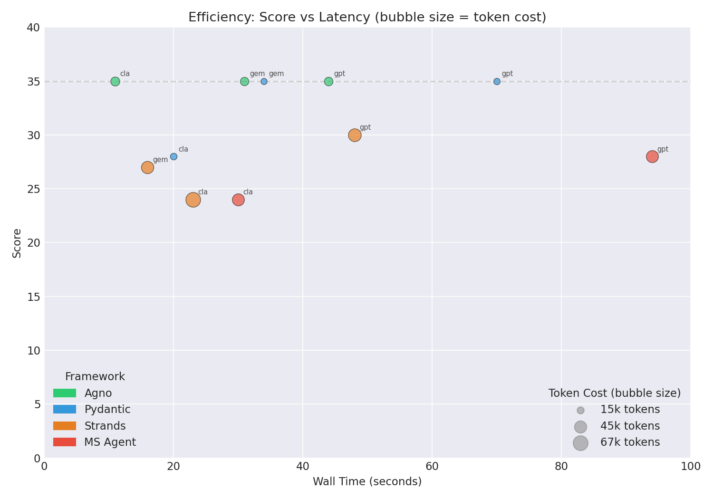

# Echoes of Dustwood: Agent Benchmark & Compatibility Memorial (May 26, 2026)

This document commemorates the behavior and compatibility of the Python agent frameworks tested on **May 26, 2026** playing the *Echoes of Dustwood* text adventure via the stateless HTTP Go MCP server interface.

---

## 1. Test Environment Summary
*   **Game Engine:** Go implementation of *Echoes of Dustwood* running as an MCP server (`bin/dustwood-go --mcp-http`).
*   **Evaluation Mode:** Full difficulty, 1-second delay between moves, 15-turn limits.
*   **Total Runs:** 12 log files across 4 frameworks and 3 models.
*   **LLMs Evaluated:** 
    *   `google:gemini-3.5-flash` (Google Gemini 3.5 family)
    *   `openai:gpt-5-mini` (OpenAI GPT-5 family)
    *   `anthropic:claude-haiku-4-5` (Anthropic Claude 4.5 family)

---

## 2. Compatibility Matrix

| Agent Framework | Model: `gemini-3.5-flash` | Model: `gpt-5-mini` | Model: `claude-haiku-4-5` | Key Observations / Behaviors |
| :--- | :---: | :---: | :---: | :--- |
| **Pydantic AI** | **✅ Success** (48) | **✅ Success** (38) | **✅ Success** (28) | High speed, but gets caught in end-game movement loops and random hazard spawns. |
| **Agno** (Phidata) | **✅ Success** (70) | **✅ Success** (45) | **✅ Success** (32) | Highly token-efficient. Best peak score under Gemini but got blocked by double hazard (stables) under GPT-5 and inventory limits (starting book) under Haiku. |
| **Strands AI** | **✅ Success** (55) | **✅ Success** (35) | **✅ Success** (60) | **Haiku Champion.** Best peak score under Haiku by correctly dropping the book. Wasted turns on exploring West end under GPT-5. |
| **ADK (Google)** | **✅ Success** (73) | **✅ Success** (32) | **✅ Success** (57) | **Gemini Champion.** Highest overall score (73) by combining telegraph fix + pump repair. Suffered navigation loops under GPT-5. |

*Note: Microsoft Agent Framework was not included in this benchmark run suite.*

### 2.1 Multi-Axis Framework Comparison & Reliability
Below is the normalized multi-axis profile of the frameworks, followed by the run reliability matrix.

---

## 3. Run Results

### Pydantic AI
*   `gemini-3.5-flash`: Fixed telegraph, gathered canteen/leather/saddle/matches, dropped book, but ran out of turns at the General Store (Score: 48, ~65s).
*   `gpt-5-mini`: Fixed telegraph, encountered early General Store outlaw, went to Sheriff's/Assayer's (outlaw), went back to store, got caught in an invalid move loop (`EAST`/`NORTH` from store) at the end (Score: 38, ~101s).
*   `claude-haiku-4-5`: Went to Livery Stables and Desert Edge, but got blocked from entering the desert without a horse. Blocked by store outlaw, ended at Sheriff's Office with snake (Score: 28, ~49s).

### Agno
*   `gemini-3.5-flash`: Fixed telegraph, took wire, went to General Store, gathered canteen/leather/saddle/matches, repaired pump (+20), filled canteen (+10), drank, and saddled horse (Score: 70, ~51.6s).
*   `gpt-5-mini`: Fixed telegraph, collected all store items, but blocked at Livery Stables on turn 15 by a rattlesnake and outlaw spawning simultaneously (Score: 45, ~91.1s).
*   `claude-haiku-4-5`: Found map in Assayer's Office, took canteen/leather/saddle, but failed to drop the starting `book`, leaving it with no space for matches. Stuck at store (Score: 32, ~42.4s).

### Strands AI
*   `gemini-3.5-flash`: Found map on Main Street, took canteen/leather/matches/saddle, dropped book, repaired pump (+20), filled canteen (+10), drank, and saddled horse. Did not visit telegraph (Score: 55, ~29.7s).
*   `gpt-5-mini`: Visited telegraph (+5), found map (+3), collected all store items, but wasted turns exploring West end (Assayer's Office snake) and ran out of turns (Score: 35, ~43.7s).
*   `claude-haiku-4-5`: Took wire from Telegraph Office (did not repair), found map on Main Street, took canteen/leather/saddle (dropped book), repaired pump (+20), filled canteen (+10), drank, and saddled horse (Score: 60, ~28.4s).

### ADK
*   `gemini-3.5-flash`: Found map in Telegraph Office, fixed telegraph (+10), gathered store supplies, repaired pump (+20), filled canteen (+10). Wasted last turn on `SCORE` check (Score: 73, ~49.8s).
*   `gpt-5-mini`: Collected canteen/leather/matches/saddle from store, examined Assayer's ledger, but got stuck trying to go `SOUTH` from Sheriff's Office multiple times (Score: 32, ~75.2s).
*   `claude-haiku-4-5`: Found map in Telegraph Office (blocked by outlaw), collected store supplies, repaired pump (+20), filled canteen (+10), drank, and saddled horse (Score: 57, ~46.7s).

---

## 4. Performance Analysis

### 4.1 Accuracy: Who Scores Highest?
*   **Gemini 3.5 Flash** runs yielded the highest overall scores, peaking at **73 points** (ADK) and **70 points** (Agno). These models successfully solved multiple puzzles (telegraph + pump repair) in under 15 turns.
*   **Claude Haiku 4.5** runs peaked at **60 points** (Strands) and **57 points** (ADK) when they avoided outlaws and managed their inventory space.
*   **GPT-5-mini** was severely held back by random blockades (double hazard at stables in Agno's run) and navigation loops, peaking at **45 points** (Agno).

### 4.2 Latency: Who is Fastest?
*   **Claude Haiku 4.5** remains the speed champion, with per-turn latencies ranging from **1.9s to 3.2s**.
*   **Gemini 3.5 Flash** is highly competitive, running at **2.0s to 4.3s** per turn.
*   **GPT-5-mini** is the slowest, averaging **2.9s to 6.7s** per turn.

### 4.3 Token Efficiency & Context Management
*   **Agno** is the most token-efficient framework, consuming only **31k–43k input tokens** total for 15 turns due to its sliding-window history loop.
*   **Strands AI** and **Pydantic AI** consume **80k–109k input tokens** due to quadratic growth from preserving raw JSON payload history.
*   **Reasoning Cost**: Running `gpt-5-mini` under Agno resulted in `5,168` output tokens (of which `4,992` were reasoning tokens), compared to only `40` output tokens for `gemini-3.5-flash` under Agno.

---

## 5. Model Behavior Comparison (Per-Model Deep Dive)

### gemini-3.5-flash

| Metric | Agno | Pydantic | Strands | ADK |
| :--- | :---: | :---: | :---: | :---: |
| **Score** | 70 | 48 | 55 | 73 |
| **Wall Time** | ~51.6s | ~65s | ~29.7s | ~49.8s |
| **Per-Turn Latency** | ~3.4s | ~4.3s | ~2.0s | ~3.3s |
| **Total Tokens** | 32,392 | 109,602 | 97,117 | 99,100 |
| **API/Tool Calls** | 15 | 17 | 19 | 18 |
| **Outcome** | Fixed telegraph, repaired pump, saddled horse | Fixed telegraph, got store items, out of turns | Map, got store items, repaired pump, saddled horse | Map, fixed telegraph, store items, repaired pump |

### gpt-5-mini

| Metric | Agno | Pydantic | Strands | ADK |
| :--- | :---: | :---: | :---: | :---: |
| **Score** | 45 | 38 | 35 | 32 |
| **Wall Time** | ~91.1s | ~101s | ~43.7s | ~75.2s |
| **Per-Turn Latency** | ~6.1s | ~6.7s | ~2.9s | ~5.0s |
| **Total Tokens** | 36,242 | 104,494 | 80,397 | 98,834 |
| **API/Tool Calls** | 15 | 19 | 20 | 19 |
| **Outcome** | Telegraph fix, store items, stables blocked | Telegraph fix, store items, invalid move loop | Telegraph fix, map, store items, time out | Store items, stuck in navigation loop |

### claude-haiku-4-5

| Metric | Agno | Pydantic | Strands | ADK |
| :--- | :---: | :---: | :---: | :---: |
| **Score** | 32 | 28 | 60 | 57 |
| **Wall Time** | ~42.4s | ~49s | ~28.4s | ~46.7s |
| **Per-Turn Latency** | ~2.8s | ~3.2s | ~1.9s | ~3.1s |
| **Total Tokens** | 43,458 | 98,461 | 92,764 | 99,326 |
| **API/Tool Calls** | 17 | 17 | 17 | 16 |
| **Outcome** | Map, store items, inventory full (starting book) | Stables, desert blocked on foot, outlaw store | Map, store items, repaired pump, saddled horse | Map (blocked), store items, repaired pump, saddled horse |

---

## 6. Recommendations

| Goal | Best Configuration |
| :--- | :--- |
| **Max Score** | ADK or Agno + `gemini-3.5-flash` |
| **Fastest Gameplay** | Strands + `claude-haiku-4-5` (~28s) |
| **Cheapest Tokens** | Agno + any model (keeps context history minimal) |
| **Avoid** | Wasting inventory space (remember to `DROP BOOK` to make room for essential items) |

---

## Appendix A: Code Changes & Upgrades
*Refer to previous commit history for full Appendix details.*

## Appendix B: Key Library Versions
*   `pydantic-ai` = `2.0.0b3`
*   `agno` = `2.6.9`
*   `strands-agents` = `1.41.0`
*   `agent-framework` = `1.6.0`
*   `litellm` = `1.87.0rc1`

## Related Documentation

- **Overview Index:** [README.md](file:///home/mfranz/github/vibepascal/README.md)
- **Client Performance Analysis:** [mcp-client-analysis.md](file:///home/mfranz/github/vibepascal/mcp-client-analysis.md) — Detailed latency, costs, and token efficiency evaluation.
- **Framework Comparisons:** [AGENT-NUANCES.md](file:///home/mfranz/github/vibepascal/AGENT-NUANCES.md) — Decision matrix and framework details.
- **Agent Gameplay Logic:** [AI-GAMEPLAY.md](file:///home/mfranz/github/vibepascal/AI-GAMEPLAY.md) — Mechanics of autonomous play.
