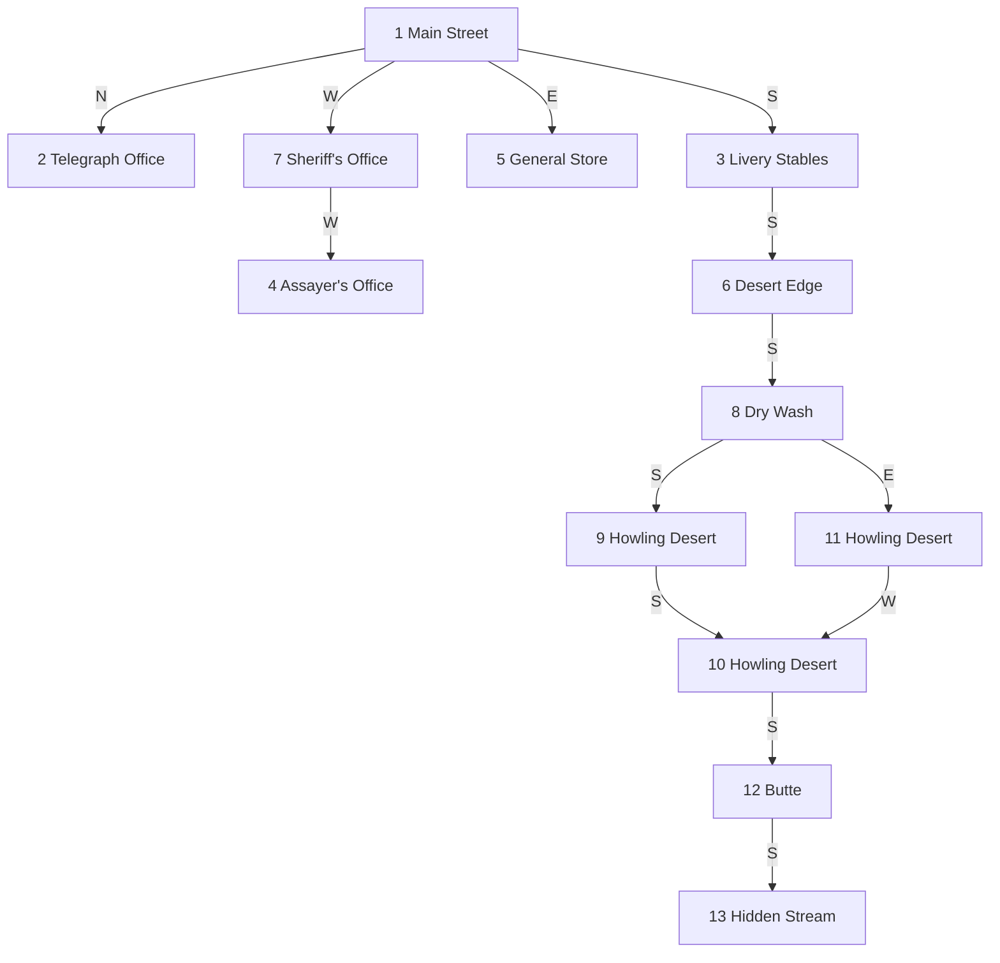

# Echoes of Dustwood

```
               _..-''-.._
            .-'  _.._    `-.
           /    /    \       \
          |    |  []  |       |
          |    |      |       |
          |    |  ____|__     |
          |    |  |  |  |     |
          |    |__|__|__|     |
          |   /  /====\  \    |
          |  /__/      \__\   |
          |   ||  ||||  ||    |
          |   ||  ||||  ||    |
      ____|___||__||||__||____|____
  ___/_____/__________________\_____\___
     |  |     |  |  |  |     |  |
     |  |     |  |  |  |     |  |
  ___|__|_____|__|__|__|_____|__|___
 /__________________________________\
    ~ ~ ~ ~ ~  D U S T W O O D  ~ ~ ~
```

A small Free Pascal text adventure. You explore a deserted frontier town in 1884, move between rooms, examine objects, and manage a simple inventory. The world (rooms, exits, items) is defined in `data/world.ini`.

The game features automatic word-wrapping for long descriptions and a custom input handler with command history and `Control-D` exit support.

## Architecture

Echoes of Dustwood uses a **Persistent Sidecar** architecture to bridge a legacy-style CLI game with modern AI agents and REST interfaces. The game engine is available in two implementations:

- **Pascal Engine (`bin/dustwood`):** The original core game logic. Written in modular Free Pascal.
- **Go Engine (`bin/dustwood-go`):** A modern port of the engine, providing identical logic and behavior with improved terminal handling.

Both engines feature a `--headless` mode for non-interactive I/O via `stdin/stdout`, allowing them to be wrapped by the sidecar.

### Component Overview

- **Game Engine:** Either the Pascal or Go implementation.
- **Sidecar API (`scripts/sidecar.py`):** A FastAPI wrapper that exposes the game as a REST service. It manages state by keeping a single headless process alive and streaming commands to it. The binary used can be configured via the `DUSTWOOD_BIN` environment variable.
- **AI Client (`scripts/ai_client.py`):** A `pydantic-ai` agent that "plays" the game. It interprets game output and selects the next command based on external guidance files.
- **Orchestrator (`scripts/ai-game.sh`):** A shell script that manages the lifecycle of the sidecar and the AI agent.

## Project Structure

```text
.
├── bin/                # Compiled Pascal and Go binaries
├── data/               # Configuration and state (world.ini, save.ini)
├── logs/               # Sidecar and AI client logs
├── scripts/            # Python sidecar, AI agents, and runners
├── tests/              # Pytest end-to-end tests for the sidecar
└── src/
    ├── golang/         # Go source code
    └── pascal/         # Modular Free Pascal source code
```

## Pascal Source Reference

- **`dustwood.pas`**: Main program entry point. Initializes state, loads world data, manages the main game loop, and enforces turn limits.
- **`u_commands.pas`**: Core game logic. Implements command parsing, movement, item interactions, survival mechanics (thirst, light), and hazard encounters.
- **`u_io.pas`**: Input and output handling. Features word-wrapping for descriptions, emoji support, and a custom input reader with command history.
- **`u_persistence.pas`**: State management for persistence. Handles saving and loading game progress to/from `data/save.ini`.
- **`u_state.pas`**: Defines the global `TGameState` record, tracking everything from inventory and room status to thirst and scores.
- **`u_types.pas`**: Centralized constants and record types (e.g., `TRoom`, `TItem`) used across the engine.
- **`u_world.pas`**: World data loader. Reads rooms and items from `data/world.ini` and handles initial randomization.

## Build

### Dependencies

- **Pascal:** `fpc` (Free Pascal Compiler)
- **Go:** `go` (1.18+)
- **Python:** `python3`, `fastapi`, `uvicorn`, `httpx`, `pytest`, `pydantic-ai`

### Compile

From the project root:

- To build the Pascal version:
  ```bash
  make build
  ```
- To build the Go version:
  ```bash
  make build-go
  ```

## Run

- Pascal version:
  ```bash
  ./bin/dustwood
  ```
- Go version:
  ```bash
  ./bin/dustwood-go
  ```

## AI Models (Pydantic AI)

The AI client uses Pydantic AI model strings. For Anthropic, set `ANTHROPIC_API_KEY` and pass an Anthropic model string, for example:

```bash
export ANTHROPIC_API_KEY="your-api-key"
./scripts/ai-game.sh medium anthropic:claude-sonnet-4-6 5
```

If you use Pydantic AI Gateway, set `PYDANTIC_AI_GATEWAY_API_KEY` and prefix with `gateway/`:

```bash
export PYDANTIC_AI_GATEWAY_API_KEY="paig_..."
./scripts/ai-game.sh medium gateway/anthropic:claude-sonnet-4-6 5
```

## Commands

- `N`, `S`, `E`, `W` or `NORTH`, `SOUTH`, `EAST`, `WEST` to move
- `LOOK` or `L` to reprint the room description
- `INVENTORY` or `I` to list what you are carrying
- `TAKE <ITEM>` or `GET <ITEM>` to pick up an item
- `DROP <ITEM>` to drop an item
- `EXAMINE <ITEM>` or `X <ITEM>` to read item descriptions
- `DRINK` to quench your thirst if your canteen has water
- `FILL` to refill your canteen at a water source
- `WATER` to water your horse at a water source
- `LIGHT` to create light (lamp if you have one, otherwise a brief match-light)
- `BURN <ITEM>` to burn flammable items (requires matches)
- `FIRE` to start a fire in certain rooms (requires matches)
- `FIX <ITEM>` to repair something in the room
- `SADDLE` to saddle the horse in the stables
- `CLIMB` to climb a steep obstacle
- `SAVE` / `LOAD` to persist your progress to `data/save.ini`
- `HELP`, `H`, or `?` to show the command list
- `QUIT` or `Q` (or `Control-D`) to exit

## Survival and Time

- **Thirst:** You must find water. If your thirst reaches its limit, the game ends.
- **Time:** The sun sinks as you move. At twilight and night, visibility changes. You may need a light source to see in the dark.
- **Turns:** You have a maximum of 50 turns before the game ends.
- **Inventory Limit:** You can carry at most 5 items.
- **Canteen Capacity:** A full canteen provides 3 drinks before it empties.
- **Light:** `LIGHT` works without a lamp; it briefly illuminates the room for a few turns.
- **Fire:** You can start fires in certain rooms; after 3 turns, items left there are destroyed.

## Objective

This is a narrative exploration and survival game. Your goal is to:
1.  **Survive:** Monitor your thirst and the passing of time.
2.  **Investigate:** Learn what happened in Dustwood by exploring the town and reading clues.
3.  **Restore:** Use the items you find to repair the town's infrastructure (like the water pump).

## Short Walkthrough

This is not the only way to play, but it will show you the current content:

1. Start on Main Street and head north to the Telegraph Office.
2. `EXAMINE WIRE` to see what remains of the communication line.
3. Return south to Main Street, then head east to the General Store.
4. `TAKE CANTEEN` and `EXAMINE CANTEEN`.
5. Return to Main Street, then head south to the Livery Stables.
6. `EXAMINE PUMP` for a clue about the town’s water situation.
7. Check your inventory and `EXAMINE BOOK` to read the personal note.
8. Head south to the Desert Edge to see the boundary of the world.

## World Information

### Rooms

- **Main Street** (Room 1): The town center. Exits north to the Telegraph Office, south to the Livery Stables, east to the General Store, and west to the Assayer's Office.
- **Telegraph Office** (Room 2): Wires are cut; Silas once worked here. South returns to Main Street.
- **Livery Stables** (Room 3): Empty stalls and a locked tack room. North returns to Main Street; south leads to the Desert Edge.
- **Assayer's Office** (Room 4): Boarded up and reinforced, recently used as a base. East returns to Main Street.
- **General Store** (Room 5): Mostly looted shelves. West returns to Main Street.
- **The Desert Edge** (Room 6): The edge of town. The desert beyond is deadly without preparation. North returns to the Livery Stables.
- **Sheriff's Office** (Room 7): A dusty office with a heavy desk and a locked gun box. East returns to Main Street; west leads to the Assayer's Office.
- **Dry Wash** (Room 8): The first stretch of desert passages.
- **Howling Desert** (Rooms 9-11): A wind-scoured maze of dunes where everything looks the same.
- **Butte** (Room 12): A steep rise with a narrow climb.
- **Hidden Stream** (Room 13): A cool stream beyond the butte.

### Map (Mermaid)



### Items

- **BOOK** (Inventory at start): A worn copy of *Plutarch's Lives* with a folded note.
- **CANTEEN** (General Store): An old, empty army canteen.
- **PUMP** (Livery Stables): An iron water pump; not takeable.
- **WIRE** (Telegraph Office): A spool of conductive copper wire. Can be used to fix the telegraph.
- **LEATHER** (General Store): A scrap of tough leather.
- **MATCHES** (General Store): A small box of matches.
- **BOX** (Sheriff's Office): A locked gun box.
- **REVOLVER** (Sheriff's Office): A loaded .44 revolver (inside the gun box).
- **HORSE** (Livery Stables): A skittish horse that needs a saddle.
- **SADDLE** (General Store): A worn leather saddle.
- **MAP** (Random town room): A faded map that reveals exits in rooms.
- **KEY** (Hidden Stream): A small brass key hidden under a rock.
- **ROCK** (Hidden Stream): A flat rock hiding something underneath.
- **LEDGER** (Assayer's Office): A torn ledger page with a clue about the key.

## World Data Format

The game loads its map and items from `data/world.ini`. It supports up to 20 rooms and 20 items. Sections are numbered:

- Rooms: `[Room1]`, `[Room2]`, ... with `Name`, `Description`, and exit fields `North`, `South`, `East`, `West` (room numbers, or `0` for none).
- Items: `[Item1]`, `[Item2]`, ... with `Name`, `Description`, `Location` (room number, or `-1` for inventory), and `IsTakeable` (`1` or `0`).

## Development

### Expanding the world

- Add or edit rooms and items in `data/world.ini`.
- Room exits are numeric links to other room IDs. Use `0` for no exit.
- Item `Location` can be a room number or `-1` to start in inventory.

### Limits

- Max rooms: `20`
- Max items: `20`

To change these, update the constants in `src/pascal/u_types.pas` and recompile.

### Suggested extensions

- Add new commands in the parser (see `ProcessCommand` in `src/pascal/u_commands.pas`).
- Add items that can be taken and combined by tracking extra state.
- Add win/lose conditions by checking inventory or room state.
