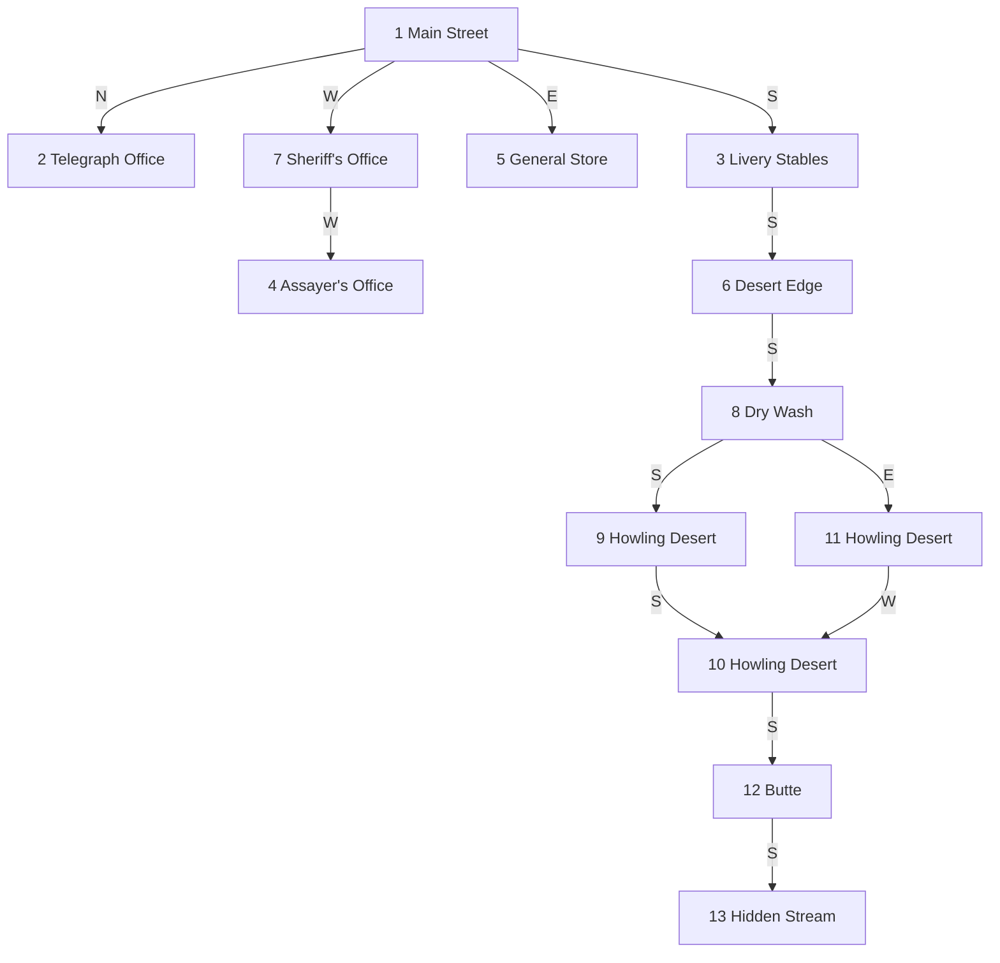

# Echoes of Dustwood

```
               _..-''-.._
            .-'  _.._    `-.
           /    /    \       \
          |    |  []  |       |
          |    |      |       |
          |    |  ____|__     |
          |    |  |  |  |     |
          |    |__|__|__|     |
          |   /  /====\  \    |
          |  /__/      \__\   |
          |   ||  ||||  ||    |
          |   ||  ||||  ||    |
      ____|___||__||||__||____|____
  ___/_____/__________________\_____\___
     |  |     |  |  |  |     |  |
     |  |     |  |  |  |     |  |
  ___|__|_____|__|__|__|_____|__|___
 /__________________________________\
    ~ ~ ~ ~ ~  D U S T W O O D  ~ ~ ~
```

A small Free Pascal text adventure. You explore a deserted frontier town in 1884, move between rooms, examine objects, and manage a simple inventory. The world (rooms, exits, items) is defined in `data/world.ini`.

The game features automatic word-wrapping for long descriptions and a custom input handler with command history and `Control-D` exit support.

## Documentation Index

Explore the detailed documentation for different areas of this project:

- **Core & Engines:**
  - [src/ARCHITECTURE.md](file:///home/mfranz/github/vibepascal/src/ARCHITECTURE.md) — Deep dive into the logic parity, dual Free Pascal and Go mirror-engine architecture.
  - [CLAUDE.md](file:///home/mfranz/github/vibepascal/CLAUDE.md) — Reference guide for Claude Code command usage, testing, and debugging.
  - [PKG.md](file:///home/mfranz/github/vibepascal/PKG.md) — System-wide dependency catalog and versioning strategy for Python and Go.
- **AI Agent Frameworks & Clients:**
  - [packages/README.md](file:///home/mfranz/github/vibepascal/packages/README.md) — Setup, dependency isolation, and configuration instructions for framework virtual environments.
  - [packages/IMPL.md](file:///home/mfranz/github/vibepascal/packages/IMPL.md) — Comparative implementation analysis of the Pydantic AI, Agno, Strands, ADK, and MS Agent clients.
  - [packages/FLOW.md](file:///home/mfranz/github/vibepascal/packages/FLOW.md) — Detailed comparison of control loops, execution flows, and logic boundaries across active clients.
  - [packages/shared/OBSERVABILITY.md](file:///home/mfranz/github/vibepascal/packages/shared/OBSERVABILITY.md) — Logging conventions, hook architectures, and token metric schemas for telemetry standardization.
- **AI Gameplay, Benchmarks, and Evaluation:**
  - [AI-GAMEPLAY.md](file:///home/mfranz/github/vibepascal/AI-GAMEPLAY.md) — Mechanics of autonomous play: stdio vs MCP interaction, prompt formatting, loop detection, and override safety.
  - [AGENT-NUANCES.md](file:///home/mfranz/github/vibepascal/AGENT-NUANCES.md) — Decision matrix and detailed observations of framework behaviors and model compatibility issues.
  - [mcp-client-analysis.md](file:///home/mfranz/github/vibepascal/mcp-client-analysis.md) — Framework and model token efficiency, cost metrics, and performance evaluation summaries.
  - [MEMORIAL-AGENTS-2026.md](file:///home/mfranz/github/vibepascal/MEMORIAL-AGENTS-2026.md) — Historical performance records, heatmaps, and variance reports for 10-turn benchmark runs (May 2026).
- **History & Narrative:**
  - [STORY.md](file:///home/mfranz/github/vibepascal/STORY.md) — Chronological storytelling of the project's rapid multi-engine and agentic evolution.

## Architecture

Echoes of Dustwood uses a **Persistent Sidecar** architecture to bridge a legacy-style CLI game with modern AI agents and REST interfaces. The game engine is available in two implementations:

- **Pascal Engine (`bin/dustwood`):** The original core game logic. Written in modular Free Pascal, it features a `--headless` mode for non-interactive I/O, turn limits, and deterministic seeding.
- **Go Engine (`bin/dustwood-go`):** A modern port of the engine, providing identical logic and behavior with improved terminal handling.

### Component Overview

- **Game Engine:** Either the Pascal or Go implementation.
- **Shared Utilities (`packages/shared/vibepascal_shared/`):** Common modules used by all framework clients:
  - `guidance_loader.py`: Loads gameplay guidance (full/medium/minimal difficulty levels)
  - `llm_observability.py`: Logging, HTTP debugging, and performance metrics
  - `mcp_command_policy.py`: Command validation and sanitization for MCP safety
- **AI Framework Packages:** Each framework has its own isolated venv and dependencies:
  - **Pydantic AI (`packages/pydantic/`):** Both direct and MCP variants using `pydantic-ai` (2.0.0b3)
  - **Strands SDK (`packages/strands/`):** Both direct and MCP variants using Strands Agents + LiteLLM
  - **Microsoft Agent Framework (`packages/ms_agent/`):** Both direct and MCP variants with broad model support
  - **Agno (`packages/agno/`):** Both direct and MCP variants using Agno (formerly Phidata)
  - **ADK (`packages/adk/`):** MCP variant using Google ADK (Python)
- **Orchestrators (root directory):**
  - `*-game.sh`: Runners for direct (stdio) client variants
  - `*-mcp-game.sh`: Runners for MCP client variants
  - `play-mcp-game.sh`: Multi-client benchmark runner
- **Chart Visualization (`charts/`):** Benchmark result visualization using matplotlib

## Project Structure

```text
.
├── bin/                # Compiled Pascal and Go binaries
├── charts/             # Benchmark visualization (matplotlib)
│   └── pyproject.toml  # Chart generation venv
├── data/               # Configuration, guidance, and state (world.ini, save.ini)
├── logs/               # MCP server and AI client logs
├── packages/           # Framework packages with isolated venvs
│   ├── shared/         # Common utilities (guidance_loader, llm_observability, mcp_command_policy)
│   ├── agno/           # Agno framework clients
│   ├── strands/        # Strands Agents SDK clients
│   ├── pydantic/       # Pydantic AI clients
│   ├── ms_agent/       # Microsoft Agent Framework clients
│   └── adk/            # Google ADK MCP client
├── src/
│   ├── golang/         # Go source code (MCP server implementation)
│   └── pascal/         # Modular Free Pascal source code
├── *.sh                # Root-level orchestrator scripts (wrappers for each framework)
└── [CLAUDE.md](file:///home/mfranz/github/vibepascal/CLAUDE.md)           # (optional) Codebase documentation for Claude Code
```

## Pascal Source Reference

- **`dustwood.pas`**: Main program entry point. Initializes state, loads world data, manages the main game loop, and enforces turn limits.
- **`u_commands.pas`**: Core game logic. Implements command parsing, movement, item interactions, survival mechanics (thirst, light), and hazard encounters.
- **`u_io.pas`**: Input and output handling. Features word-wrapping for descriptions, emoji support, and a custom input reader with command history.
- **`u_persistence.pas`**: State management for persistence. Handles saving and loading game progress to/from `data/save.ini`.
- **`u_state.pas`**: Defines the global `TGameState` record, tracking everything from inventory and room status to thirst and scores.
- **`u_types.pas`**: Centralized constants and record types (e.g., `TRoom`, `TItem`) used across the engine.
- **`u_world.pas`**: World data loader. Reads rooms and items from `data/world.ini` and handles initial randomization.

## Go Source Reference

- **`main.go`**: Main program entry point. Initializes state, loads world data, manages the main game loop, and enforces turn limits.
- **`commands.go`**: Core game logic. Implements command parsing, movement, item interactions, survival mechanics (thirst, light), and hazard encounters.
- **`io.go`**: Input and output handling. Features word-wrapping for descriptions, emoji support, and a custom input reader with command history.
- **`persistence.go`**: State management for persistence. Handles saving and loading game progress to/from `data/save.ini`.
- **`state.go`**: Defines the global `GameState` struct, tracking everything from inventory and room status to thirst and scores.
- **`types.go`**: Centralized constants and struct types (e.g., `Room`, `Item`) used across the engine.
- **`world.go`**: World data loader. Reads rooms and items from `data/world.ini` and handles initial randomization.

## Build

### Dependencies

- **Pascal:** `fpc` (Free Pascal Compiler)
- **Go:** `go` (1.18+)
- **Python:** `python3`, `fastapi`, `uvicorn`, `httpx`, `pytest`, `pydantic-ai`

### Compile

From the project root:

- To build the Pascal version:
  ```bash
  make build
  ```
- To build the Go version:
  ```bash
  make build-go
  ```

## Run

- Pascal version:
  ```bash
  ./bin/dustwood [options]
  ```
- Go version:
  ```bash
  ./bin/dustwood-go [options]
  ```

### MCP (Go Engine)

Run the Go engine as an MCP Streamable HTTP server (localhost-only by default):

```bash
./bin/dustwood-go --mcp-http --mcp-addr 127.0.0.1:8765 --mcp-json-response
```

Example MCP JSON-RPC calls (using `curl`):

```bash
curl -s -D /tmp/mcp_headers -o /tmp/mcp_body -X POST http://127.0.0.1:8765/mcp \
  -H "Content-Type: application/json" \
  -H "Origin: http://localhost" \
  -H "Accept: application/json, text/event-stream" \
  -d '{"jsonrpc":"2.0","id":1,"method":"initialize","params":{"protocolVersion":"2024-11-05","clientInfo":{"name":"curl","version":"0.1"},"capabilities":{}}}'

SESSION_ID=$(sed -n "s/^Mcp-Session-Id: //p" /tmp/mcp_headers | tr -d "\r")

curl -s -X POST http://127.0.0.1:8765/mcp \
  -H "Content-Type: application/json" \
  -H "Origin: http://localhost" \
  -H "Accept: application/json, text/event-stream" \
  -H "Mcp-Session-Id: $SESSION_ID" \
  -H "MCP-Protocol-Version: 2024-11-05" \
  -d '{"jsonrpc":"2.0","id":2,"method":"tools/list"}'

curl -s -X POST http://127.0.0.1:8765/mcp \
  -H "Content-Type: application/json" \
  -H "Origin: http://localhost" \
  -H "Accept: application/json, text/event-stream" \
  -H "Mcp-Session-Id: $SESSION_ID" \
  -H "MCP-Protocol-Version: 2024-11-05" \
  -d '{"jsonrpc":"2.0","id":3,"method":"tools/call","params":{"name":"command","arguments":{"command":"LOOK"}}}'
```

#### Adding to Claude Code

Start the server in stateless JSON mode (simplest for Claude Code):

```bash
./bin/dustwood-go --mcp-http --mcp-stateless --mcp-json-response
```

Then register the server with Claude Code. For a **user-level** (global) installation:

```bash
claude mcp add --transport http dustwood http://127.0.0.1:8765/mcp
```

For a **project-level** installation (stored in `.claude/settings.json`):

```bash
claude mcp add --transport http --scope project dustwood http://127.0.0.1:8765/mcp
```

If you started the server with `--mcp-token <token>`, add the header:

```bash
claude mcp add --transport http --header "Authorization: Bearer <token>" dustwood http://127.0.0.1:8765/mcp
```

Verify the server is recognized:

```bash
claude mcp list
```

#### Adding to Codex

Start the server in stateless JSON mode (simplest for Codex):

```bash
./bin/dustwood-go --mcp-http --mcp-stateless --mcp-json-response
```

Then register the server with Codex. For a **user-level** (global) installation:

```bash
codex mcp add --transport http dustwood http://127.0.0.1:8765/mcp
```

For a **project-level** installation (stored in `.codex/config.toml`):

```bash
codex mcp add --transport http --scope project dustwood http://127.0.0.1:8765/mcp
```

If you started the server with `--mcp-token <token>`, add the header:

```bash
codex mcp add --transport http --header "Authorization: Bearer <token>" dustwood http://127.0.0.1:8765/mcp
```

Verify the server is recognized:

```bash
codex mcp list
```

Once added, these clients expose a `command` tool backed by the game. The tool accepts:

| Field | Type | Description |
|-------|------|-------------|
| `command` | string | Game command to execute (e.g. `LOOK`, `N`, `TAKE CANTEEN`) |
| `reset` | bool | Reset the game to a fresh state before executing |
| `seed` | int64 | Seed to use when resetting (optional) |

The tool returns:

| Field | Type | Description |
|-------|------|-------------|
| `output` | string | Raw game text output |
| `state.room_id` | int | Current room number |
| `state.room_name` | string | Current room name |
| `state.turns` | int | Turns taken so far |
| `state.score` | int | Current score |
| `state.is_playing` | bool | Whether the game is still active |
| `state.thirst` | int | Player thirst counter |
| `state.horse_thirst` | int | Horse thirst counter |
| `state.has_water` | bool | Whether the canteen has water |
| `state.is_dark` | bool | Whether the current room is dark |
| `state.lamp_lit` | bool | Whether the lamp is lit |
| `state.horse_saddled` | bool | Whether the horse is saddled |
| `state.is_riding` | bool | Whether the player is riding |
| `state.inventory` | []string | Item descriptions currently carried |

MCP flags:

- `--mcp-http`: Run the MCP server.
- `--mcp-addr <host:port>`: Listen address (default `127.0.0.1:8765`).
- `--mcp-path <path>`: MCP endpoint path (default `/mcp`).
- `--mcp-origin <origin>`: Allowed origin (repeatable; defaults to localhost origins).
- `--mcp-token <token>`: Require `Authorization: Bearer <token>`.
- `--mcp-json-response`: Return JSON responses instead of SSE.
- `--mcp-stateless`: Disable sessions/SSE and accept only POST requests.
- `--seed <n>`: Deterministic seed (applies to MCP server start and optional reset).

### AI Agents via MCP

You can run AI agents that interact with the game through the MCP interface. These clients are more robust as they use the structured state returned by the server.

**1. Start the MCP Server:**
```bash
./bin/dustwood-go --mcp-http --mcp-addr 127.0.0.1:8765 --mcp-json-response
```

**2. Sync the framework package (one-time setup):**
Each framework has isolated dependencies. Choose one and sync it:
```bash
cd packages/pydantic && uv sync --prerelease=allow
# OR
cd packages/agno && uv sync --upgrade
# OR
cd packages/strands && uv sync --upgrade
# OR
cd packages/ms_agent && uv sync --upgrade
# OR
cd packages/adk && uv sync --upgrade
```

**3. Run an MCP Client from the repo root:**

- **Pydantic AI MCP Client:**
  ```bash
  ./pydantic-mcp-game.sh full google:gemini-3.5-flash 1 5
  ```

- **Strands Agent MCP Client:**
  ```bash
  ./strands-mcp-game.sh full gemini/gemini-3.5-flash 1 5
  ```

- **Agno MCP Client:**
  ```bash
  ./agno-mcp-game.sh full gemini/gemini-3.5-flash 1 5
  ```

- **Microsoft Agent MCP Client:**
  ```bash
  ./ms-agent-mcp-game.sh full gpt-4o-mini 1 5
  ```

- **ADK MCP Client:**
  ```bash
  ./adk-mcp-game.sh full gemini-3.5-flash 1 5
  ```

### Options

- `-h`, `--h`, `--help`: Show the help message.
- `--headless`: Run in headless mode (for AI agents or scripts).
- `--turns <n>`: Set the maximum number of turns (default: 25).
- `--seed <n>`: Set the random seed for deterministic gameplay.

## Setup & Installation

### Per-Framework Virtual Environments

Each AI framework has incompatible dependencies and lives in its own isolated package with a dedicated venv:

- **packages/shared/** — Common utilities (no external deps beyond httpx)
- **packages/pydantic/** — Pydantic AI (2.0.0b3, requires `--prerelease=allow`)
- **packages/strands/** — Strands Agents SDK + LiteLLM
- **packages/agno/** — Agno 2.6.9+
- **packages/ms_agent/** — Microsoft Agent Framework
- **packages/adk/** — Google ADK 2.0.0 (MCP)
- **charts/** — Visualization dependencies

### Quick Start

1. **Build the game:**
   ```bash
   make build-go
   ```

2. **Sync a framework package (pick one):**
   ```bash
   cd packages/pydantic && uv sync --prerelease=allow
   # OR
   cd packages/agno && uv sync --upgrade
   # etc.
   ```

3. **Start the MCP server:**
   ```bash
   ./bin/dustwood-go --mcp-http --mcp-addr 127.0.0.1:8765 --mcp-json-response
   ```

4. **In another terminal, run a game:**
   ```bash
   ./pydantic-mcp-game.sh full google:gemini-3.5-flash 1 5
   ```

### Environment Variables

Set your API keys as needed:

```bash
export GOOGLE_API_KEY="..."       # For Gemini models
export ANTHROPIC_API_KEY="..."    # For Claude models
export OPENAI_API_KEY="..."       # For GPT models
export GEMINI_API_KEY="..."       # Alternative Gemini key
export OLLAMA_HOST="localhost:11434"  # For local Ollama
```

### Troubleshooting

**"Unknown provider" error:** Make sure you're using the correct model prefix for the framework:
- Pydantic AI: `google:gemini-3.5-flash` or `anthropic:claude-3-5-sonnet-20241022`
- Strands: `gemini/gemini-3.5-flash` or `anthropic/claude-3-5-sonnet-20241022` (LiteLLM format)
- Agno/MS Agent: Framework-specific naming (check wrapper script comments)
- ADK: native Gemini ID (for example `gemini-3.5-flash`) or LiteLLM provider format (for example `openai/gpt-5-mini`)

**Prerelease deps:** Pydantic AI 2.0.0b3 has pre-release dependencies. Always use `uv sync --prerelease=allow` for that package.

## AI Models & Framework Setup

Each framework has its own isolated venv and dependencies. Set up the API keys you need, then run via the orchestrator scripts.

### 1. Pydantic AI (2.0.0b3)
Uses the Pydantic AI framework with support for Anthropic and Google Gemini.

```bash
cd packages/pydantic && uv sync --prerelease=allow
```

- **Google Gemini (Direct):**
  ```bash
  export GOOGLE_API_KEY="your-api-key"
  ./pydantic-game.sh full google:gemini-3.5-flash 1 25
  ```
- **Anthropic Claude (Direct):**
  ```bash
  export ANTHROPIC_API_KEY="your-api-key"
  ./pydantic-game.sh full anthropic:claude-3-5-sonnet-20241022 1 25
  ```
- **Via MCP:**
  ```bash
  ./pydantic-mcp-game.sh full google:gemini-3.5-flash 1 5
  ```

### 2. Strands SDK (Recommended for multi-provider)
Uses Strands Agents SDK and LiteLLM for broad model support.

```bash
cd packages/strands && uv sync --upgrade
```

- **Google Gemini:**
  ```bash
  export GEMINI_API_KEY="your-api-key"
  ./strands-game.sh full gemini/gemini-3.5-flash 1 25
  ```
- **Anthropic Claude:**
  ```bash
  export ANTHROPIC_API_KEY="your-api-key"
  ./strands-game.sh full anthropic/claude-3-5-sonnet-20241022 1 25
  ```
- **Ollama (Local):**
  ```bash
  export OLLAMA_HOST="127.0.0.1:11434"
  ./strands-game.sh minimal ollama/granite4:latest 1 25
  ```
- **Via MCP:**
  ```bash
  ./strands-mcp-game.sh full gemini/gemini-3.5-flash 1 5
  ```

### 3. Microsoft Agent Framework
Optimized for goal-oriented tasks with broad provider support.

```bash
cd packages/ms_agent && uv sync --upgrade
```

- **OpenAI GPT-4o:**
  ```bash
  export OPENAI_API_KEY="your-api-key"
  ./ms-agent-game.sh full gpt-4o-mini 1 25
  ```
- **Anthropic Claude:**
  ```bash
  export ANTHROPIC_API_KEY="your-api-key"
  ./ms-agent-game.sh full claude-3-5-sonnet-20241022 1 25
  ```
- **Google Gemini:**
  ```bash
  export GEMINI_API_KEY="your-api-key"
  ./ms-agent-game.sh full gemini-3.5-flash 1 25
  ```
- **Via MCP:**
  ```bash
  ./ms-agent-mcp-game.sh full gpt-4o-mini 1 5
  ```

### 4. Agno (formerly Phidata)
Lightweight multimodal agent framework.

```bash
cd packages/agno && uv sync --upgrade
```

- **OpenAI GPT-4o:**
  ```bash
  export OPENAI_API_KEY="your-api-key"
  ./agno-game.sh full gpt-4o-mini 1 25
  ```
- **Anthropic Claude:**
  ```bash
  export ANTHROPIC_API_KEY="your-api-key"
  ./agno-game.sh full claude-3-5-sonnet-20241022 1 25
  ```
- **Via MCP:**
  ```bash
  ./agno-mcp-game.sh full gpt-4o-mini 1 5
  ```

### 5. ADK (Google Agent Development Kit)
Google's Agent Development Kit with MCP toolset integration.

```bash
cd packages/adk && uv sync --upgrade
```

- **Via MCP:**
  ```bash
  export GOOGLE_API_KEY="your-api-key"
  ./adk-mcp-game.sh full gemini-3.5-flash 1 5
  ```

- **Via LiteLLM provider routing (OpenAI example):**
  ```bash
  export OPENAI_API_KEY="your-api-key"
  ./adk-mcp-game.sh full gpt-5-mini 1 5
  ```

### Multi-Client Benchmark

Run all 5 frameworks sequentially against a single model:

```bash
./play-mcp-game.sh google:gemini-3.5-flash full 1 5
```

## Commands

- `N`, `S`, `E`, `W` or `NORTH`, `SOUTH`, `EAST`, `WEST` to move
- `LOOK` or `L` to reprint the room description
- `LOOK <DIR>` to peer into an adjacent room (e.g., `LOOK NORTH`)
- `INVENTORY` or `I` to list what you are carrying
- `TAKE <ITEM>` or `GET <ITEM>` to pick up an item
- `DROP <ITEM>` to drop an item
- `EXAMINE <ITEM>` or `X <ITEM>` to read item descriptions
- `DRINK` to quench your thirst if your canteen has water
- `FILL` to refill your canteen at a water source
- `WATER` to water your horse at a water source
- `LIGHT` to create light (lamp if you have one, otherwise a brief match-light)
- `BURN <ITEM>` to burn flammable items (requires matches)
- `FIRE` to start a fire in certain rooms (requires matches)
- `FIX <ITEM>` to repair something in the room
- `SADDLE` to saddle the horse in the stables
- `CLIMB` to climb a steep obstacle
- `SAVE` / `LOAD` to persist your progress to `data/save.ini`
- `HELP`, `H`, or `?` to show the command list
- `QUIT` or `Q` (or `Control-D`) to exit

## Survival and Time

- **Thirst:** You must find water. If your thirst reaches its limit, the game ends.
- **Time:** The sun sinks as you move. At twilight and night, visibility changes. You may need a light source to see in the dark.
- **Turns:** You have a maximum of 25 turns before the game ends.
- **Inventory Limit:** You can carry at most 5 items.
- **Canteen Capacity:** A full canteen provides 3 drinks before it empties.
- **Light:** `LIGHT` works without a lamp; it briefly illuminates the room for a few turns.
- **Fire:** You can start fires in certain rooms; after 3 turns, items left there are destroyed.

## Objective

This is a narrative exploration and survival game. Your goal is to:
1.  **Survive:** Monitor your thirst and the passing of time.
2.  **Investigate:** Learn what happened in Dustwood by exploring the town and reading clues.
3.  **Restore:** Use the items you find to repair the town's infrastructure (like the water pump).

## Short Walkthrough

This is not the only way to play, but it will show you the current content:

1. Start on Main Street and head north to the Telegraph Office.
2. `EXAMINE WIRE` to see what remains of the communication line.
3. Return south to Main Street, then head east to the General Store.
4. `TAKE CANTEEN` and `EXAMINE CANTEEN`.
5. Return to Main Street, then head south to the Livery Stables.
6. `EXAMINE PUMP` for a clue about the town’s water situation.
7. Check your inventory and `EXAMINE BOOK` to read the personal note.
8. Head south to the Desert Edge to see the boundary of the world.

## World Information

### Rooms

- **Main Street** (Room 1): The town center. Exits north to the Telegraph Office, south to the Livery Stables, east to the General Store, and west to the Assayer's Office.
- **Telegraph Office** (Room 2): Wires are cut; Silas once worked here. South returns to Main Street.
- **Livery Stables** (Room 3): Empty stalls and a locked tack room. North returns to Main Street; south leads to the Desert Edge.
- **Assayer's Office** (Room 4): Boarded up and reinforced, recently used as a base. East returns to Main Street.
- **General Store** (Room 5): Mostly looted shelves. West returns to Main Street.
- **The Desert Edge** (Room 6): The edge of town. The desert beyond is deadly without preparation. North returns to the Livery Stables.
- **Sheriff's Office** (Room 7): A dusty office with a heavy desk and a locked gun box. East returns to Main Street; west leads to the Assayer's Office.
- **Dry Wash** (Room 8): The first stretch of desert passages.
- **Howling Desert** (Rooms 9-11): A wind-scoured maze of dunes where everything looks the same.
- **Butte** (Room 12): A steep rise with a narrow climb.
- **Hidden Stream** (Room 13): A cool stream beyond the butte.

### Map (Mermaid)


```mermaid
graph TD
  R1["1 Main Street"] -- N --> R2["2 Telegraph Office"]
  R1 -- S --> R3["3 Livery Stables"]
  R1 -- E --> R5["5 General Store"]
  R1 -- W --> R7["7 Sheriff's Office"]
  R7 -- W --> R4["4 Assayer's Office"]
  R3 -- S --> R6["6 Desert Edge"]
  R6 -- S --> R8["8 Dry Wash"]
  R8 -- S --> R9["9 Howling Desert"]
  R8 -- E --> R11["11 Howling Desert"]
  R9 -- S --> R10["10 Howling Desert"]
  R11 -- W --> R10
  R10 -- S --> R12["12 Butte"]
  R12 -- S --> R13["13 Hidden Stream"]
```

### Items

- **BOOK** (Inventory at start): A worn copy of *Plutarch's Lives* with a folded note.
- **CANTEEN** (General Store): An old, empty army canteen.
- **PUMP** (Livery Stables): An iron water pump; not takeable.
- **WIRE** (Telegraph Office): A spool of conductive copper wire. Can be used to fix the telegraph.
- **LEATHER** (General Store): A scrap of tough leather.
- **MATCHES** (General Store): A small box of matches.
- **BOX** (Sheriff's Office): A locked gun box.
- **REVOLVER** (Sheriff's Office): A loaded .44 revolver (inside the gun box).
- **HORSE** (Livery Stables): A skittish horse that needs a saddle.
- **SADDLE** (General Store): A worn leather saddle.
- **MAP** (Random town room): A faded map that reveals exits in rooms.
- **KEY** (Hidden Stream): A small brass key hidden under a rock.
- **ROCK** (Hidden Stream): A flat rock hiding something underneath.
- **LEDGER** (Assayer's Office): A torn ledger page with a clue about the key.

## World Data Format

The game loads its map and items from `data/world.ini`. It supports up to 20 rooms and 20 items. Sections are numbered:

- Rooms: `[Room1]`, `[Room2]`, ... with `Name`, `Description`, and exit fields `North`, `South`, `East`, `West` (room numbers, or `0` for none).
- Items: `[Item1]`, `[Item2]`, ... with `Name`, `Description`, `Location` (room number, or `-1` for inventory), and `IsTakeable` (`1` or `0`).

## Development

### Expanding the world

- Add or edit rooms and items in `data/world.ini`.
- Room exits are numeric links to other room IDs. Use `0` for no exit.
- Item `Location` can be a room number or `-1` to start in inventory.

### Limits

- Max rooms: `20`
- Max items: `20`

To change these, update the constants in `src/pascal/u_types.pas` and recompile.

### Suggested extensions

- Add new commands in the parser (see `ProcessCommand` in `src/pascal/u_commands.pas`).
- Add items that can be taken and combined by tracking extra state.
- Add win/lose conditions by checking inventory or room state.
