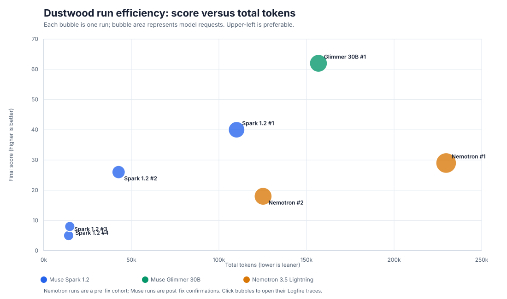
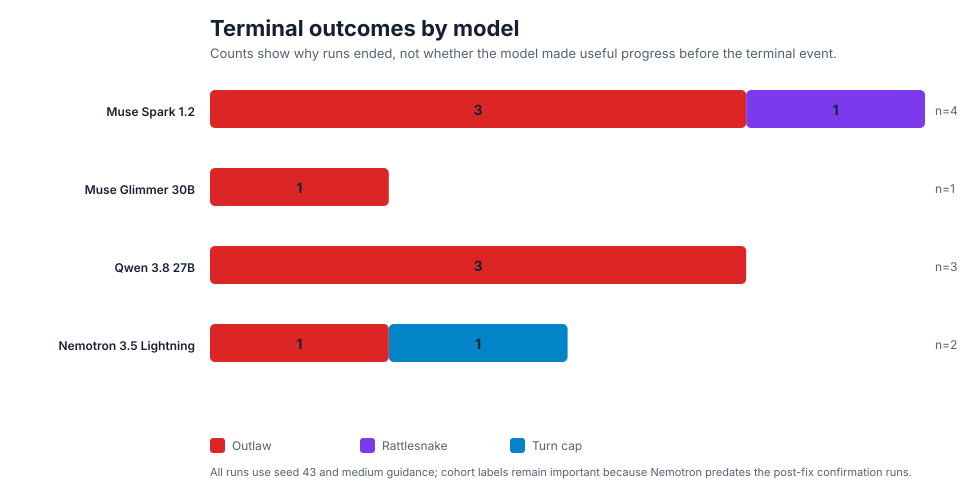

# Dustwood Ground-Truth Baseline: Gameplay, Efficiency, and Decisions

**Analysis date:** August 17, 2026

**Scope:** four post-fix `meta/muse-spark-1.2` confirmation runs, one post-fix
`meta/muse-glimmer-30b` confirmation run, and two earlier
`nvidia/nemotron-3.5-lightning` benchmark runs.

**Shared configuration:** seed `43`, medium guidance, 30-turn maximum, one fresh Go MCP server
per run, and Logfire EU telemetry. The Nemotron runs predate the client/server hardening changes,
so they are retained as gameplay evidence but labeled as a separate cohort.

**Source manifest:** [`dustwood-ground-truth-runs-2026-08-17.json`](dustwood-ground-truth-runs-2026-08-17.json)

## What this baseline measures

This is deliberately not a single composite score or model leaderboard. It tracks three separate
questions:

1. **Gameplay outcome:** final score, survival time, and terminal event.
2. **Efficiency:** total tokens and model requests needed to achieve that outcome.
3. **Decision quality:** trace-grounded action sequences that explain progress, plateaus, and
   deaths.

Low token use is not automatically good when it results from dying immediately; likewise, a
30-turn run is not automatically good if it spends its late turns in an invalid-action loop.

## Charts

The first chart should be read as a trade-off view, not a ranking. Higher score and lower token
use are desirable, but terminal survival and the trace evidence below determine whether a point is
actually a useful run. The second chart identifies the dominant failure mode: direct engagement
with visible hazards, particularly outlaws.

## Run-level outcome and efficiency

| Model | Cohort | Run | Score / turn | Terminal event | Requests | Total tokens | Tokens / score | Trace |
| :-- | :-- | --: | :-- | :-- | --: | --: | --: | :-- |
| Muse Spark 1.2 | post-fix | 1 | 40 / 17 | Rattlesnake, Assayer's Office | 23 | 110,080 | 2,752 | [trace](https://logfire-eu.pydantic.dev/last-name-franz/mcp-eval/?q=trace_id%3D%2701a0121a-2b2a-76f1-a0b6-9653ddf2d80f%27) |
| Muse Spark 1.2 | post-fix | 2 | 26 / 9 | Outlaw, General Store | 12 | 42,713 | 1,643 | [trace](https://logfire-eu.pydantic.dev/last-name-franz/mcp-eval/?q=trace_id%3D%2701a0121c-a1b7-7144-b8af-7fa1e9a204ad%27) |
| Muse Spark 1.2 | post-fix | 3 | 5 / 1 | Outlaw, Telegraph Office | 5 | 14,190 | 2,838 | [trace](https://logfire-eu.pydantic.dev/last-name-franz/mcp-eval/?q=trace_id%3D%2701a0121d-6cc7-7038-abaa-53471fd4c4be%27) |
| Muse Spark 1.2 | post-fix | 4 | 8 / 2 | Outlaw, Telegraph Office | 5 | 14,847 | 1,856 | [trace](https://logfire-eu.pydantic.dev/last-name-franz/mcp-eval/?q=trace_id%3D%2701a0121e-2a42-71f4-9b55-64d3cbb42172%27) |
| Muse Glimmer 30B | post-fix | 1 | 62 / 17 | Outlaw, General Store | 28 | 156,818 | 2,529 | [trace](https://logfire-eu.pydantic.dev/last-name-franz/mcp-eval/?q=trace_id%3D%2701a01216-e657-72cf-ae6f-c80945838dc7%27) |
| Nemotron 3.5 Lightning | pre-fix | 1 | 29 / 30 | Client turn cap | 41 | 229,698 | 7,921 | [trace](https://logfire-eu.pydantic.dev/last-name-franz/mcp-eval/?q=trace_id%3D%2701a01201-4601-76fd-aee4-e455122c965b%27) |
| Nemotron 3.5 Lightning | pre-fix | 2 | 18 / 18 | Outlaw, Assayer's Office | 28 | 125,209 | 6,956 | [trace](https://logfire-eu.pydantic.dev/last-name-franz/mcp-eval/?q=trace_id%3D%2701a01202-49f6-7169-85b9-5b8224deaf41%27) |

## Cohort view

| Model | Cohort | Runs | Mean score | Mean terminal turn | Mean tokens | Mean requests | Interpretable finding |
| :-- | :-- | --: | --: | --: | --: | --: | :-- |
| Muse Spark 1.2 | post-fix | 4 | 19.8 | 7.3 | 45,458 | 11.3 | Low-cost but fragile; hazard response dominates results. |
| Muse Glimmer 30B | post-fix | 1 | 62.0 | 17.0 | 156,818 | 28.0 | Strong progress in one run; insufficient sample for a ranking. |
| Nemotron 3.5 Lightning | pre-fix | 2 | 23.5 | 24.0 | 177,454 | 34.5 | Better survival, but expensive and poorly converted into score. |

The key efficiency signal is not raw tokens. Nemotron's longer survival cost roughly 7k–8k tokens
per point, more than twice the Muse runs. Spark's short failures look lean in absolute tokens, but
they are gameplay failures because it repeatedly dies before it can exploit the available route.

## Trace-grounded decision evidence

| Run | Evidence from the action trace | Decision-quality reading |
| :-- | :-- | :-- |
| Spark 1 | Reached the Assayer's Office, used `FREEZE` while a rattlesnake was present, then used `TAKE MAP`; the snake struck. | It identified a danger but did not preserve the safety gained by freezing it. |
| Spark 2 | Entered the General Store with an outlaw visible and then used `TAKE CANTEEN`; the outlaw shot it. | It treated a visible immediate threat as ordinary loot collection. |
| Spark 3 | Entered the Telegraph Office with an outlaw visible and then used `TAKE MAP`; the outlaw shot it. | The same threat-prioritization failure occurred at turn 1. |
| Spark 4 | Entered the Telegraph Office with an outlaw visible and then used `TAKE WIRE`; the outlaw shot it. | Repeats the Spark hazard pattern independently of the target item. |
| Glimmer 1 | Collected clues and supplies, repaired the pump, filled and drank from the canteen, then entered the General Store with an outlaw present and used `FREEZE`; it died. | The run shows effective multi-step resource planning but no reliable outlaw policy. |
| Nemotron 1 | Reached score 29 by turn 24, then repeatedly issued invalid `DROP` commands in the General Store through the turn cap. | The failure was state tracking and recovery: it did not stop or revise after repeated no-progress results. |
| Nemotron 2 | Reached the Assayer's Office with an outlaw present and used `TALK TO OUTLAW`; the outlaw shot it. | The model selected an unsupported or unsafe interaction instead of retreating or preparing. |

## Ground-truth findings

### Gameplay outcome

Six of the seven runs ended because the agent acted after an outlaw or rattlesnake was already
visible. This is the strongest cross-model gameplay finding in this cohort. The fixed seed creates
a comparable environment, but it does not control the action-dependent timing and placement of
hazards, so the conclusion is about response to explicit danger rather than a claim that a given
room is always unsafe.

Spark had the highest variance in survival: its four runs ranged from turn 1 to turn 17. Glimmer
matched Spark's best survival time while achieving 22 more points, but that is a single-run data
point. Nemotron survived longer on average, yet did not convert that time into score because of
invalid inventory actions.

### Efficiency

The efficiency chart makes a useful distinction between **early inexpensive failure** and
**expensive low-yield persistence**. Spark's two Telegraph deaths consumed only about 14k–15k
tokens, but provided almost no gameplay value. Nemotron's turn-cap run consumed 229,698 tokens
for 29 points because its final six turns produced no score gain.

For future reporting, `tokens / score` should remain a secondary metric paired with a survival
threshold. It is useful for detecting waste after a model is already making progress; it should
never make a one-turn death look efficient.

### Decision quality

The first useful decision-quality taxonomy is small and observable:

- **Threat response:** retreat, prepare, or take a risky action after a hazard is visible.
- **No-progress recovery:** change strategy after a failed or invalid action rather than repeat it.
- **Resource conversion:** turn clues, items, water, and movement into score or survival.

This avoids speculative scoring of the model's hidden reasoning. Each label comes from a tool call,
tool result, and engine state transition in the linked trace.

## Next collection changes

The manifest is intentionally manual for this first seven-run cohort. The next increment should
emit the same fields directly from the client into a JSONL file, including `elapsed_ms`, model turns,
MCP calls, score delta per turn, room, visible threats, action verb, and an automatically classified
terminal event. That will allow the SVG generator to produce larger cross-model charts without
hand transcription.

For model comparison, collect at least five fresh runs per model under one post-fix configuration,
randomize serial model order, and keep the raw manifest alongside the generated report. That is the
minimum needed before using these measures to make a recommendation rather than an exploratory
observation.
