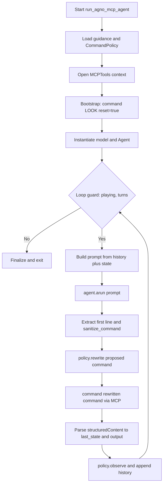
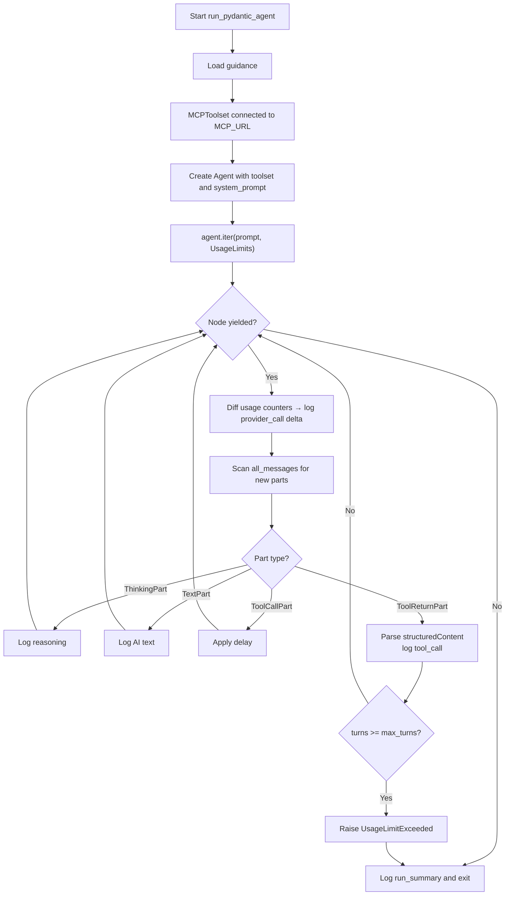
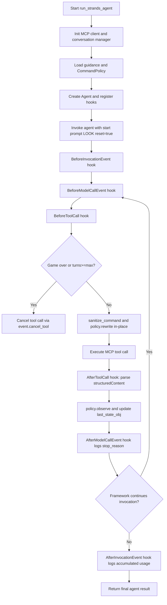
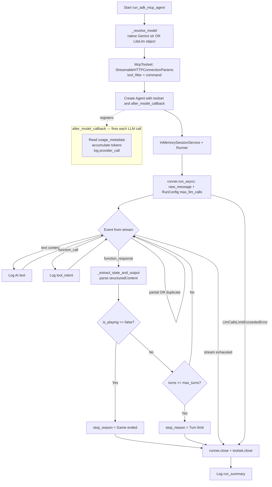

# Execution Flow and Logic in MCP Clients

This document complements `OBSERVABILITY.md` by focusing on **execution flow and decision logic** across the active MCP clients in `packages/`.
It describes where control decisions are made (loop, tool boundary, or hooks), where state is updated, and where termination is enforced.

## High-Level Architectural Summary

The MCP clients cluster into two practical patterns for managing LLM-to-game interaction:

1. **Loop-Centric (Procedural)**: `agno_mcp_client.py`
   - **Center of gravity**: Explicit `while` loop in the run function.
   - **Logic shape**: Prompt construction, model invocation, command extraction, policy rewrite, and state updates are handled step-by-step in one loop. The loop owner explicitly calls `policy.rewrite()` and `policy.observe()`.

2. **Event/Node-Centric (Reactive)**: `pydantic_mcp_client.py`, `strands_mcp_client.py`, `adk_mcp_client.py`
   - **Center of gravity**: Framework lifecycle hooks or async event/node streams.
   - **Logic shape**: No explicit Python game `while` loop. The framework drives tool calls; policy and state transitions are injected via iterator nodes (Pydantic AI), lifecycle hooks (Strands), or a callback + event stream (ADK).

> **MS Agent** (`ms_agent_mcp_client.py`) was a hybrid loop + tool-boundary client but is no longer invoked by `play-mcp-game.sh` and is considered deprecated. It is retained in the repo but excluded from this analysis.

## Purpose and Scope

This analysis compares how each active client:
- Orchestrates the game loop
- Decides the next command
- Applies policy rewrites and loop-breaking
- Updates state and history
- Terminates execution

This document is intentionally about **control flow and logic boundaries**, not telemetry schema design (see `OBSERVABILITY.md`).

## Cross-Client Flow Matrix

| Dimension | Agno MCP | Pydantic AI MCP | Strands MCP | ADK MCP |
| :--- | :--- | :--- | :--- | :--- |
| Orchestration style | Explicit async while-loop | Fully autonomous `agent.iter()` node loop | Fully autonomous `agent(prompt)` single call with hooks | Fully autonomous `runner.run_async()` event stream |
| Main control loop owner | `run_agno_mcp_agent` | Pydantic AI agent runtime | Strands framework invocation lifecycle | ADK `Runner` |
| Command normalization point | Loop: sanitize model text before policy rewrite | Not applicable — framework drives tool calls | `BeforeToolCall` hook rewrites `event.tool_use["input"]` | Not applicable — ADK drives tool calls |
| Policy rewrite point | Loop (`policy.rewrite(...)`) | Not used — no `CommandPolicy` | `BeforeToolCall` hook | Not used — no `CommandPolicy` |
| Policy observe/update point | After each command result in loop | Not used | `AfterToolCall` hook after structured result parse | Not used |
| Bootstrap behavior | Calls `command("LOOK", reset=True)` before agent instantiation | Prompt instructs first tool call as `LOOK` with `reset=True` | Prompt instructs first tool call as `LOOK` with `reset=True` | Prompt instructs first tool call as `LOOK` with `reset=True` |
| Turn-limit enforcement | Loop condition + policy rewrite behavior | `ToolReturnPart` handler raises `UsageLimitExceeded` when `state.turns >= max_turns` | `BeforeToolCall` hook sets `event.cancel_tool` when `turns >= max_turns` | `stop_reason` set in `function_response` handler; `LlmCallsLimitExceededError` caught |
| Non-progress handling | `CommandPolicy` loop-breaker rewrites repeated commands | None — relies on model reasoning | Primarily policy rewrite in hook; no forced fallback | None — relies on model reasoning and `RunConfig` call cap |
| State source of truth | `last_state` + `last_output_text` in run scope | Parsed from `ToolReturnPart.content` in iterator | `last_state_obj` + `last_output_text` updated in `AfterToolCall` hook | Parsed from `function_response` events via `_extract_state_and_output` |
| Termination conditions | `is_playing == False`, turn cap, LLM-call cap | `UsageLimitExceeded` (turn cap or request limit), game-ended flag in state | Tool calls canceled at hook for game-end or turn cap; agent call returns | `is_playing == False`, `turns >= max_turns`, `LlmCallsLimitExceededError`, stream exhausted |

## Per-Client Execution Flows

### 1) Agno MCP Flow

1. Startup/bootstrap
   - Load guidance, init `CommandPolicy`, set `max_llm_calls`, open `MCPTools` context.
   - **Model and `Agent` are instantiated after the bootstrap `LOOK`**, not before: bootstrap runs first so the initial room state is available before entering the loop.

2. First command/session initialization
   - Local async `command(...)` sends MCP `command` call.
   - Bootstrap state with `command("LOOK", reset=True)` and `policy.observe(...)`.

3. Prompt construction and model invocation
   - Build prompt from recent history + current state summary + remaining turns.
   - Run model via `agent.arun(prompt)`.

4. Command extraction/sanitization
   - Extract first line from model output, strip code fences, run `sanitize_command(...)`.

5. Policy rewrite gate
   - Apply `policy.rewrite(proposed_command=raw_cmd, state=last_state, max_turns=...)`.

6. Tool execution and state update
   - Execute rewritten command through local `command(...)`.
   - Parse structured content into `last_state`/`last_output_text`.
   - Update policy/history with executed command and resulting state.

7. Loop termination/fallback
   - Stop on `is_playing == False`, `turns >= max_turns`, or `llm_calls >= max_llm_calls`.
   - No extra deterministic post-step forced move; depends on policy loop-break rewrite.

Why it matters:
- Agno keeps policy at the loop level, so model output is explicitly transformed before any tool call.

### 2) Pydantic AI MCP Flow

> **Note**: Unlike the other clients, Pydantic AI uses no `CommandPolicy` or explicit game loop. The framework drives all tool calls autonomously; the client only monitors emitted nodes to enforce the turn cap.

1. Startup/bootstrap
   - Load guidance, create `MCPToolset`, instantiate `Agent` with system prompt embedding guidance.

2. First command/session initialization
   - Prompt instructs: "Start by calling `command` with `reset=True`".
   - Framework dispatches the tool call directly — no explicit Python bootstrap step.

3. Prompt construction and model invocation
   - Single prompt at `agent.iter()` entry; framework manages all subsequent model calls.
   - Optional thinking enabled when `AI_REASONING=1` (`Thinking()` capability + `anthropic_thinking` model settings).

4. Command extraction/sanitization
   - Not applicable — framework passes tool args directly from model output to the MCP server.

5. Policy rewrite gate
   - Not used. No `CommandPolicy` in this client.

6. Tool execution and state update
   - `ToolReturnPart` carries parsed `structuredContent`; client reads `state.turns`, `state.room_name`, etc. for console display and turn-cap checks.

7. Loop termination/fallback
   - `UsageLimitExceeded` raised when `state.turns >= max_turns` or `UsageLimits.request_limit` hit.
   - `UnexpectedModelBehavior` caught as normal end condition.

Why it matters:
- Pydantic AI delegates all tool-call decisions to the framework; the client is a thin observer that enforces a single hard stop condition.

### 3) Strands MCP Flow

> **Note**: `run_strands_agent` is a **synchronous** function (`def`, not `async def`). The Strands framework drives the event loop internally via its synchronous `agent(prompt)` call, unlike the other clients which are all `async def` driven by `asyncio.run`.

1. Startup/bootstrap
   - Initialize MCP transport client (stdio, SSE, or streamable-http), `SlidingWindowConversationManager`, `CommandPolicy`, and agent with hooks.

2. First command/session initialization
   - Single top-level prompt instructs first tool call as `command='LOOK', reset=True`.
   - Framework invocation drives subsequent model/tool steps.

3. Prompt construction and model invocation
   - Prompt is static at entry; iterative control occurs through framework lifecycle and tool results.
   - `BeforeModelCallEvent` timestamps each model call; `AfterModelCallEvent` logs per-call latency and `stop_reason`.

4. Command extraction/sanitization
   - `BeforeToolCall` hook inspects `event.tool_use["input"]["command"]` and rewrites it via `sanitize_command(...)`.

5. Policy rewrite gate
   - `BeforeToolCall` rewrites command via `policy.rewrite(...)` in-place on `event.tool_use["input"]`.
   - Same hook cancels tool when game ended or turn limit reached via `event.cancel_tool`.

6. Tool execution and state update
   - `AfterToolCall` parses structured result into `last_state_obj`/`last_output_text`.
   - Calls `policy.observe(...)` using executed command and resulting state.

7. Loop termination/fallback
   - Tool calls are canceled at boundary for end-state/turn-cap.
   - No explicit outer while-loop fallback analogous to a forced move.

Why it matters:
- Strands treats control as lifecycle events, so policy and state transitions are mediated by hooks rather than an explicit Python loop.

### 4) ADK MCP Flow

> **Note**: ADK is the only client that uses a `Runner` / `Session` abstraction. State from tool responses is extracted from the event stream rather than from a hook or iterator node.

1. Startup/bootstrap
   - `_resolve_model()` maps the model string to a native Gemini ID or `LiteLlm(model=...)` object.
   - `McpToolset` opens a persistent Streamable HTTP connection with `tool_filter=["command"]`.
   - `after_model_callback` registered on the `Agent` for per-call token accumulation.

2. First command/session initialization
   - Single prompt instructs: "Start with `LOOK` and `reset=True`".
   - ADK `Runner` dispatches tool calls autonomously.

3. Prompt construction and model invocation
   - Single prompt at entry; `RunConfig(max_llm_calls=max(8, max_turns * 4))` caps total LLM calls.

4. Command extraction/sanitization
   - Not applicable — ADK passes tool args directly from model output.

5. Policy rewrite gate
   - Not used. No `CommandPolicy` in this client.

6. Tool execution and state update
   - `function_response` events carry `structuredContent`; `_extract_state_and_output` parses it.
   - `stop_reason` is set when `is_playing == False` or `turns >= max_turns`.

7. Loop termination/fallback
   - `LlmCallsLimitExceededError` is caught and treated as a clean stop.
   - `stop_reason` field logged in final `run_summary`.

Why it matters:
- ADK is the most framework-opaque client: the game loop, tool dispatch, and retry logic are all internal to the ADK `Runner`. The client is purely declarative.

## Cross-Client Logic Contrasts

- **Policy boundary placement**:
  Loop-level in Agno; hook-level in Strands; not used in Pydantic AI or ADK.

- **State ownership model**:
  Agno keeps state in loop-scoped variables. Strands keeps state in hook-scoped closures near the tool boundary. Pydantic AI and ADK read state transiently from emitted events/nodes.

- **Non-progress strategy**:
  Agno relies on `CommandPolicy` loop-breaker rewriting repeated commands. Strands applies the same via `BeforeToolCall` hook. Pydantic AI and ADK have no explicit recovery — they depend on the model varying its behavior naturally.

- **Model prefix/routing**:
  Agno selects native model objects (`Claude`, `Gemini`, etc.) by prefix-stripping. ADK uses `_resolve_model()` to return either a plain string (native Gemini) or `LiteLlm(model=...)`. Strands relies entirely on LiteLLM routing. Pydantic AI uses its own `KnownModelName` strings.

## Invariants and Risk Points

Invariants to preserve across clients:
- Command should be sanitized before hitting MCP `command` execution.
- Policy rewrite should run before non-reset game commands (Agno, Strands).
- Policy observe should run after successful stateful command execution (Agno, Strands).
- Turn cap should be enforceable even if model keeps requesting actions.

Risk points to monitor in future analysis:
- Divergence when no `structuredContent` is returned (state may lag).
- Different non-progress handling produces materially different trajectories between Agno/Strands and Pydantic/ADK.
- Hook/tool-boundary rewrites can be harder to reason about than explicit loop transforms.
- Prompt/history window differences can change command quality independently of policy.
- ADK and Pydantic AI have no loop-break protection — a model stuck in a repetitive pattern relies solely on `RunConfig`/`UsageLimits` to terminate.
