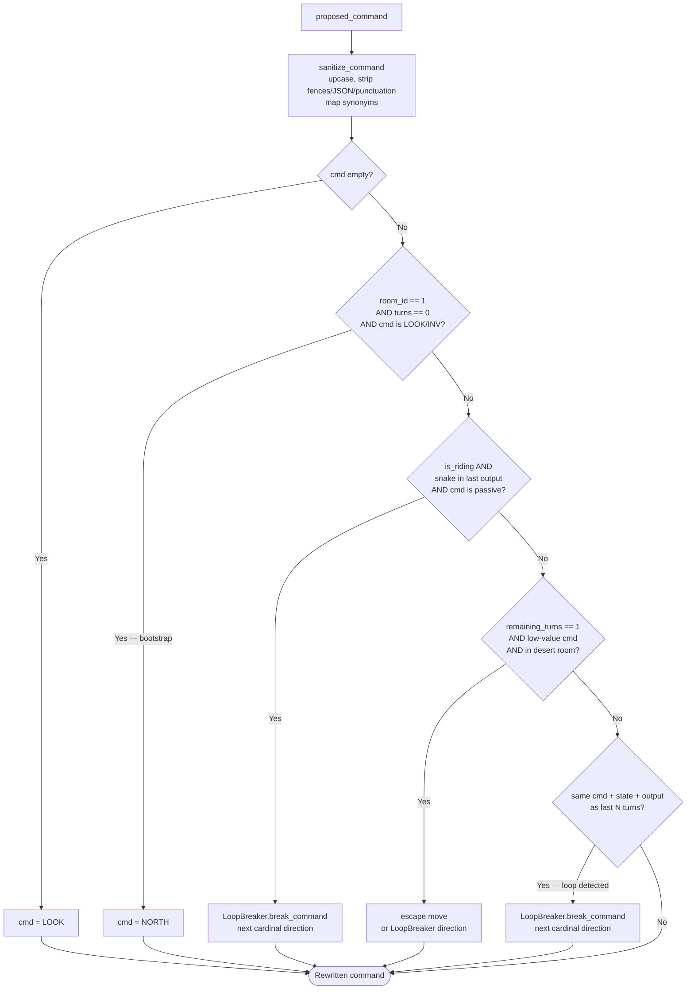

# MCP Client Implementation Summary

Each framework package (`packages/<fw>/`) contains an `*_mcp_client.py` that connects an AI agent to the Dustwood game server over MCP (Model Context Protocol). Four clients are actively benchmarked (Pydantic AI, Agno, Strands, ADK). All four share the same CLI interface and high-level goal but differ in how the agentic loop is structured.

## Common Patterns

Every client:

- Accepts four positional args: `level` (full/medium/minimal), `model_name`, `delay` (seconds between tool calls), `max_turns`
- Reads `MCP_URL` from env (default `http://127.0.0.1:8765/mcp`)
- Writes structured logs to `logs/<fw>_mcp_client-{epoch}.log` via `setup_logger(__name__, LOG_FILE)`
- Emits `provider_call`, `tool_call`, and `run_summary` events via `log_kv()`
- Loads gameplay hints via `load_guidance(level)` + `format_guidance_block()` from `vibepascal_shared`
- Syncs `GOOGLE_API_KEY` ↔ `GEMINI_API_KEY`

The game server exposes a single `command` MCP tool. Each call returns `structuredContent` with `{ output: str, state: { roomName, turns, score, thirst, isPlaying, ... } }`.

---

## `pydantic/pydantic_mcp_client.py`

**Framework:** Pydantic AI (pre-release 2.0.0b3)

**Loop style:** Fully autonomous — one `agent.iter()` call, framework drives all tool calls.

**How it works:**

1. `MCPToolset(MCP_URL)` wraps the MCP server; passed to `Agent(toolsets=[...])`.
2. The agent is started with `agent.iter(prompt, usage_limits=UsageLimits(request_limit=...))` as an async context manager.
3. Each yielded node may contain `ThinkingPart`, `TextPart`, `ToolCallPart`, or `ToolReturnPart` messages. The client iterates `agent_run.all_messages()` and de-duplicates by `id(part)`.
4. Token usage, tool calls, and model requests/responses are captured as Logfire spans via `logfire.instrument_pydantic_ai()` (opt-in with `LOGFIRE_ENABLED`; see `packages/shared/OBSERVABILITY.md`) rather than manually tracked in the client.
5. Turn limit is enforced by raising `UsageLimitExceeded` inside the `ToolReturnPart` handler when `state.turns >= max_turns`.
6. Thinking (extended reasoning) is optionally enabled via `AI_REASONING=1` env var, which adds a `Thinking()` capability and sets `anthropic_thinking` model settings.

**Model support:** Native Pydantic AI `KnownModelName` strings — e.g., `google-gla:gemini-3-flash-preview`, `anthropic:claude-3-5-sonnet-20241022`.

---

## `agno/agno_mcp_client.py`

**Framework:** Agno 2.6.9+

**Loop style:** Hybrid — outer Python while loop, agent asked for one command at a time.

**How it works:**

1. `MCPTools(url=MCP_URL, transport=MCP_TRANSPORT)` is used as an async context manager. The client calls `mcp_tools.session.call_tool("command", ...)` directly, bypassing Agno's agent for the actual MCP dispatch.
2. An `Agent` with a system prompt is created. On each iteration the client builds a `prompt` string containing recent history and current game state, calls `await agent.arun(prompt)`, and extracts the raw command from `run_output.content`.
3. The raw model output is cleaned with `sanitize_command()` and rewritten by `CommandPolicy.rewrite()` before being dispatched to the game.
4. A `_provider_post_hook` registered on the agent extracts Agno metrics (input/output/reasoning tokens) from `run_output.metrics` and accumulates them.
5. History is windowed to `policy.history_limit` entries; the loop exits when `is_playing=False`, turns reach `max_turns`, or LLM call budget is exhausted.

**Model support:** Agno native model objects — `Claude`, `Gemini`, `OpenAIChat`, `Ollama` — selected by prefix-stripping the input model name.

---

## `strands/strands_mcp_client.py`

**Framework:** Strands Agents SDK + LiteLLM

**Loop style:** Fully autonomous — single synchronous `agent(prompt)` call, framework drives all tool calls.

**How it works:**

1. `MCPClient` is created with one of three transports (streamable-http, SSE, stdio) selected by `--transport` arg.
2. `LiteLLMModel(model_id=...)` handles model routing; bare `gemini-*` IDs are auto-prefixed with `gemini/`.
3. `SlidingWindowConversationManager(window_size=10)` keeps context bounded.
4. All observability is attached via the Strands hooks system: `BeforeInvocationEvent`, `AfterInvocationEvent`, `BeforeModelCallEvent`, `AfterModelCallEvent`, `BeforeToolCallEvent`, `AfterToolCallEvent`.
5. The `_before_tool_call` hook enforces the turn limit and `CommandPolicy`: it may set `event.cancel_tool` to abort a call, or rewrite `tool_input["command"]` in-place.
6. The `_after_tool_call` hook parses `structuredContent` from the result and updates `last_state_obj` and `last_output_text`.
7. Token usage is read from `event.result.metrics.accumulated_usage` in `_after_invocation`.

**Model support:** Any LiteLLM-supported model string (`gemini/...`, `anthropic/...`, `openai/...`, `ollama/...`, etc.).

---

## `adk/adk_mcp_client.py`

**Framework:** Google ADK 2.0.0 + LiteLLM extension

**Loop style:** Fully autonomous — single `runner.run_async()` event stream.

**How it works:**

1. `McpToolset(connection_params=StreamableHTTPConnectionParams(...), tool_filter=["command"])` connects to the MCP server and exposes the `command` tool to the agent.
2. An `Agent` is created with `tools=[toolset]` and an `after_model_callback` that reads `llm_response.usage_metadata` and accumulates token counts per call.
3. `Runner.run_async()` yields events; the client iterates them, skipping partials and de-duplicating by event ID.
4. `event.get_function_calls()` and `event.get_function_responses()` are used to log tool intent and results.
5. Game state is extracted from `response.structuredContent` inside tool response events; `state.is_playing` and `state.turns >= max_turns` determine when to set `stop_reason`.
6. The turn budget is capped via `RunConfig(max_llm_calls=max(8, max_turns * 4))`; `LlmCallsLimitExceededError` is caught and treated as a clean stop.
7. `_resolve_model()` maps model strings to either a native Gemini ID (string) or a `LiteLlm(model=...)` object, enabling non-Gemini models through LiteLLM.

**Model support:** Native Gemini IDs (e.g. `gemini-3.5-flash`) and any LiteLLM provider string (e.g. `openai/gpt-5-mini`, `anthropic/claude-3-5-sonnet-20241022`).

---

## Shared Library (`packages/shared/vibepascal_shared/`)

### `llm_observability.py`

- `setup_logger(name, log_file)` — creates a `DEBUG`-level file handler logger; conditionally adds a console handler (`LOG_CONSOLE`) and enables HTTP debug logging (`LOG_HTTP`). Returns the configured logger. Used by all four clients to replace ~20 lines of identical setup.
- `Timer` — perf_counter-based elapsed time helper.
- `log_kv(logger, **fields)` — emits a single `key=json_value ...` log line; all values JSON-encoded, newlines escaped.
- `redact_secrets(text)` — strips API keys and Bearer tokens from log output.
- `format_payload(value)` — serializes an object to JSON and truncates to `LOG_MAX_CHARS` (default 20 000).
- Env flags: `LOG_CONSOLE`, `GAME_CONSOLE`, `LOG_HTTP`, `LOG_PAYLOADS`, `LOG_MAX_CHARS`.

### `mcp_command_policy.py`

- `sanitize_command(cmd)` — normalises model output to a single uppercase game command: strips markdown fences, JSON wrappers, punctuation, and maps synonyms (`GET→TAKE`, `INSPECT→EXAMINE`, etc.).
- `LoopBreaker` — detects when the same command produces the same state+output twice in a row and substitutes a cardinal direction to escape the loop.
- `CommandPolicy` — combines `LoopBreaker` with a turn-budget rewriter: forces a move off the starting room on turn 0, avoids wasteful commands on the last turn in desert rooms, and overrides stuck snake encounters.
- Configured from env: `MCP_HISTORY_LIMIT`, `MCP_LOOP_REPEAT_THRESHOLD`, `MCP_MAX_LLM_CALLS_MULTIPLIER`.

### `guidance_loader.py`

- `load_guidance(value)` — resolves `"full"`, `"medium"`, or `"minimal"` to `data/guidance_{level}.txt` under the repo root, or accepts a path directly. Returns a `GuidanceConfig(path, text)` dataclass.
- `format_guidance_block(cfg)` — formats a `GuidanceConfig` into the `"\n\nGUIDANCE (follow this):\n..."` string injected into each client's system prompt, or `""` if no guidance is loaded.

### CommandPolicy Flow

## Related Documentation

- **Framework Setup & Overview:** [packages/README.md](file:///home/mfranz/github/vibepascal/packages/README.md)
- **Detailed Control Flow:** [packages/FLOW.md](file:///home/mfranz/github/vibepascal/packages/FLOW.md) — Comparison of execution loops and logical boundaries.
- **Observability Configuration:** [packages/shared/OBSERVABILITY.md](file:///home/mfranz/github/vibepascal/packages/shared/OBSERVABILITY.md) — Telemetry logging setup.
- **Main Overview Index:** [README.md](file:///home/mfranz/github/vibepascal/README.md)
