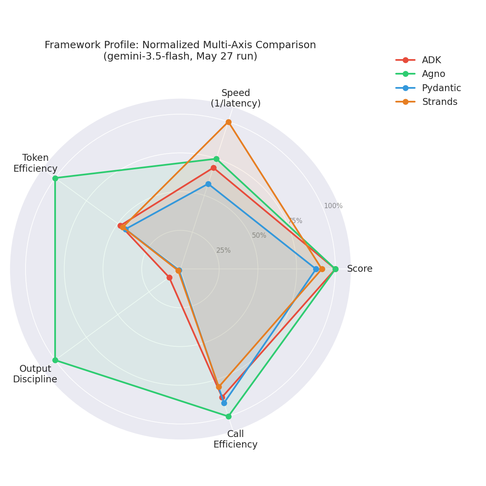
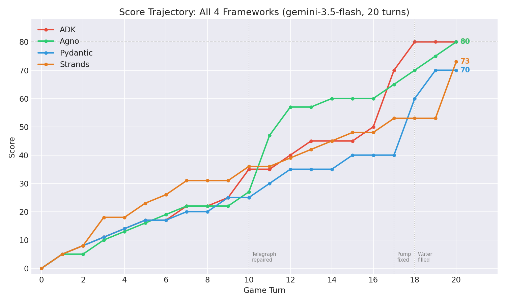
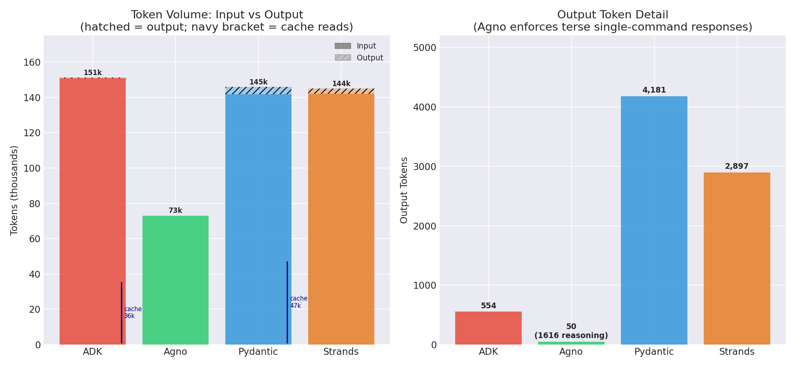
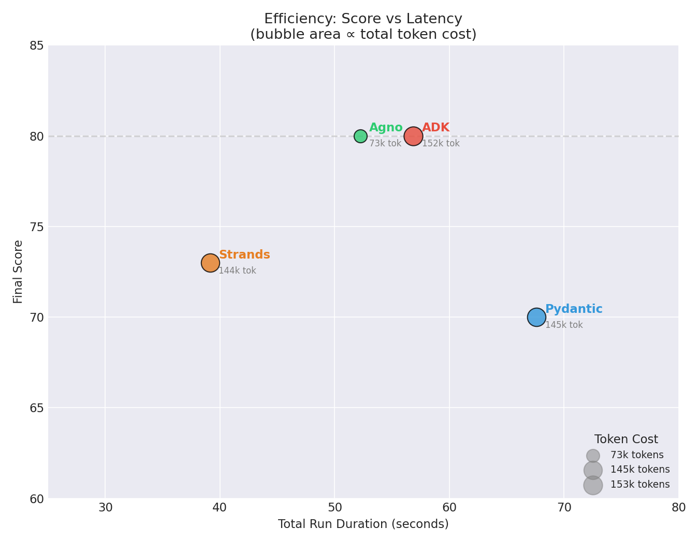
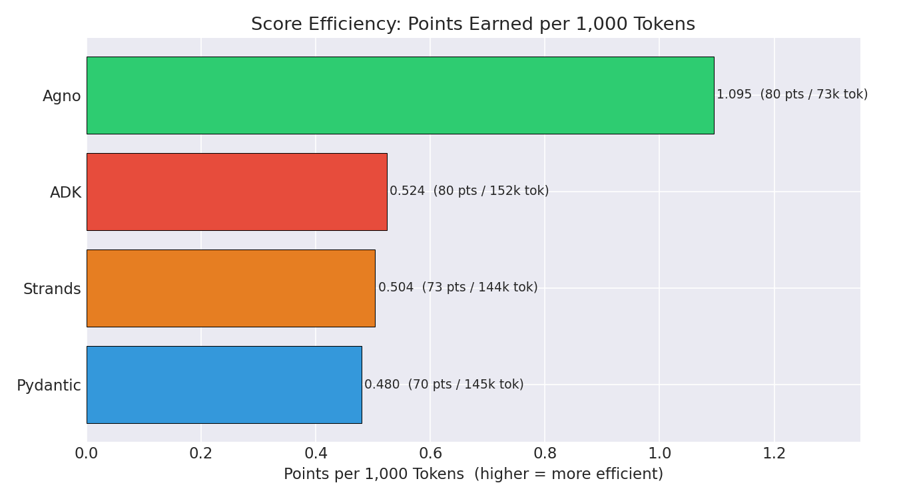
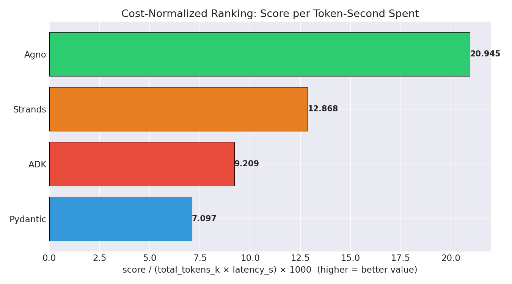

# Comparative Analysis: Google ADK, Agno, Pydantic AI, & Strands
**Date:** Wednesday, May 27, 2026

This document presents a comprehensive comparative analysis of the four agent frameworks evaluated on the "Echoes of Dustwood" MCP text adventure game benchmark. The analysis is based on the session databases and log files generated from fresh runs of each framework.

---

## 1. Executive Summary & Metrics

Below is the consolidated performance and token metric matrix across all four runs:

| Dimension / Metric | Google ADK | Agno | Pydantic AI | Strands |
| :--- | :---: | :---: | :---: | :---: |
| **Final Game Score** | **80** | **80** | **70** | **73** |
| **Game Turns Taken** | 20 / 20 | 20 / 20 | 20 / 20 | 20 / 20 |
| **LLM Calls (Requests)** | 23 | **20** | 22 | 25 |
| **Total Input Tokens** | 150,707 | **73,036** | 141,733 | 142,079 |
| **Total Output Tokens** | 554 | **50** | 4,181 | 2,897 |
| **Total Run Tokens** | 152,757 | **73,086** | 145,914 | 144,976 |
| **Total Run Duration** | 56.8s | 52.2s | 67.6s | **39.1s** |
| **Prompt Cache Reads** | **36,029** | *Unreported* | **47,764** | *Unreported* |
| **Reasoning Tokens** | Yes | **1,616** | Yes | *Unreported* |
| **Session Format** | SQLite DB | SQLite DB | Single JSON | Multi-JSON Dir |
| **Session Messages Count** | 46 events | 20 turns | 42 messages | 50 files |



---

## 2. Gameplay Behavior & Strategy

The agents encountered different starting environments (due to map randomization and threat placement), yielding distinct gameplay outcomes:

*   **Google ADK (Score: 80)**: Played a systematic and cautious game. It cleared out the General Store first (canteen, leather, matches, saddle), repaired the telegraph in the Telegraph Office, encountered the outlaw in the Assayer's Office, safely retreated back to Main Street, repaired the pump in the Livery Stables, drank, and saddled the horse on turn 20. It mounted on turn 21 — a trailing action executed after the turn limit was reached before ADK's invocation concluded cleanly.
*   **Agno (Score: 80)**: Navigated away from a combined snake/outlaw room on turn 1. It dropped the starting book to free up inventory space, gathered the General Store items, repaired the pump, filled/drank water, and successfully saddled/mounted the horse to ride deep into the Howling Desert, reaching Room 10 by turn 20.
*   **Strands (Score: 73)**: Successfully repaired the telegraph and located the map. It collected all General Store items, repaired the pump, but ran out of turns before it could fill, drink, saddle, or mount the horse.
*   **Pydantic AI (Score: 70)**: Collected General Store items but got caught in an exploration/pathfinding loop moving between Main Street, Sheriff's Office, and Assayer's Office to avoid rattlesnakes and outlaws. The Telegraph Office was visited only once during this detour, not as a repeated loop destination. It repaired the pump and drank, but did not saddle or mount.



---

## 3. Session & State Serialization

The four frameworks take fundamentally different approaches to storing session history and state data:

### Google ADK
*   **Target**: `sessions/adk_sessions.db` (SQLite via SQLAlchemy/aiosqlite).
*   **Design**: Highly structured relational tables (`sessions`, `events`, `app_states`, `user_states`). Individual conversational steps are logged as separate rows in the `events` table (1 user prompt + 1 model reply per call, resulting in exactly **46 event rows** for the 23 requests).
*   **Cleanup**: Configured with a foreign key constraint (`ondelete="CASCADE"`), meaning deleting a session clean-deletes all associated event records.

### Agno
*   **Target**: `sessions/agno_sessions.db` (SQLite via `sqlite3`).
*   **Design**: Flat table serialization. High-level state and run metrics are stored directly inside JSON columns in the `dustwood_agno_sessions` table. 
*   **Auditability**: Session token and reasoning counts are stored under the `session_metrics` JSON field, matching the log output exactly (e.g. `input_tokens: 73036`).

### Pydantic AI
*   **Target**: `sessions/pydantic_sessions/pydantic-session-*.json` (JSON).
*   **Design**: Serializes the list of `ModelMessage` objects into a single JSON file.
*   **Count**: Contains exactly **42 messages** (1 start prompt + 20 execution turns consisting of a request/return pair + 1 summary response), matching `agent_run.all_messages()` exactly.
*   **Overhead**: Simple to read, but requires rewriting the entire conversation array to disk on every step.

### Strands
*   **Target**: `sessions/strands_sessions/session_strands-*/` (Directory).
*   **Design**: Extremely modular directory structure.
*   **Count**: Stores each conversational turn in its own file under `/agents/agent_default/messages/` (exactly **50 JSON files** representing the 25 user/model request pairs).
*   **Efficiency**: Extremely fast incremental writes since Strands only appends one small file per turn instead of rewriting the entire history.

---

## 4. Efficiency & Output Verbosity

*   **Agno is the most token-efficient framework (73,086 total tokens)**. It enforces a strict output policy where the model responds with only the raw command verb/noun (e.g., `"TAKE CANTEEN"` or `"SOUTH"`), yielding just **50 output tokens** across the entire 20-turn run.
*   **Pydantic AI (4,181 output tokens) and Strands (2,897 output tokens) suffer from output bloat**. The model frequently includes markdown lists, plans, and summaries in its responses, inflating the context window and API costs on subsequent turns.
*   **ADK lies in the middle (554 output tokens)**. It uses direct native tool calls, which avoids conversational fluff but still retains structured tool arguments in the conversation history.



---

## 5. Performance & Latency

*   **Strands is the fastest (39.1s total run)**, utilizing LiteLLM with minimal framework loop overhead.
*   **Agno is close behind (52.2s)**, processing sequential commands quickly with low latency.
*   **ADK (56.8s) and Pydantic AI (67.6s) are slower** due to additional framework validation, event tracking, and state rehydration logic during execution.







---

## 6. Prompt Caching & Reasoning

*   **Pydantic AI (47,764 cached tokens)** and **Google ADK (36,029 cached tokens)** natively capture and log Gemini prompt caching statistics (`cache_read_tokens`). 
*   **Strands and Agno do not report cache reads** because their transport wrappers (LiteLLM for Strands, and custom client wrappers for Agno) discard Gemini-specific `cached_content_token_count` metadata before it reaches logging hooks.
*   **Agno (1,616 reasoning tokens)** and **ADK** explicitly track model reasoning tokens (Gemini's internal thinking budget), providing visibility into how much compute the model spent planning its game moves.

---

## 7. Qualitative Analysis: How Each Framework Shapes Gemini's Behavior

Beyond raw metrics, the session data reveals that the four frameworks elicit measurably different behavior from the same underlying model (gemini-3.5-flash). The differences arise from three design choices each framework makes: the system prompt it writes, the tool interface it exposes, and how it manages context across turns.

### 7.1 System Prompt Philosophy

Each framework frames the task differently, which visibly shapes the model's tone and output style:

| Framework | Prompt Mechanism | Length | Core Constraint |
| :--- | :--- | :--- | :--- |
| **ADK** | `instruction=` (baked into agent definition, persists every call) | ~350 chars | "Use the `command` tool for every game interaction." Rules-first, no persona. |
| **Agno** | `description=` (agent self-description, not a system role) + rich per-turn context block | ~300 + ~200/turn | "Only output a single game command per step (one line, no extra text)." |
| **Pydantic AI** | `system_prompt=` (classic system role) | ~600+ chars | Persona-first ("You are an expert adventurer"), extensive gameplay guidance, multiple specialized tools. |
| **Strands** | `system_prompt=` (shortest of the four) | ~200 chars | "Analyze the state (inventory, thirst, room) to make survival decisions." Minimal rules. |

Agno is the only framework that constructs a **structured context block per turn** rather than relying on the conversation history to implicitly carry state:

```
RECENT HISTORY (most recent last):
cmd=LOOK, cmd=EAST, cmd=TAKE CANTEEN, ...

CURRENT STATE:
Room: General Store (ID: 5) | Score: 17 | Turns: 5
Inventory: canteen, leather, matches, saddle

Remaining game turns: 15
Output exactly one next game command (one line).
```

This is the mechanism behind Agno's bounded context window: instead of appending raw tool results to the conversation, it summarizes the relevant state into a compact block on every call, then truncates older history via a sliding window.

### 7.2 Tool Interface Design

Three frameworks expose a single generic `command(str)` tool. Pydantic AI exposes **semantic, typed tools** instead:

- `go(direction: str)` — navigation
- `take(item: str)` — item pickup
- `drop(item: str)` — item drop
- `drink()` — consume water
- `command(command: str)` — fallback for complex commands

This changes how Gemini reasons: with a single `command` tool, the model must produce the correct parser syntax as a string argument (`"TAKE CANTEEN"`). With typed tools, the model decides *which action type* to invoke, then fills in structured arguments (`take(item="canteen")`). The result is visible in the session: Pydantic is the only framework where Gemini never uses the raw `command` tool for movement — it uses `go(direction="east")` instead, which is more structured but also more verbose in the output token encoding.

### 7.3 Output Verbosity: Per-Call Token Pattern

The per-call output token data shows fundamentally different verbosity profiles:

**Agno** — model outputs the game command as raw text; the framework interprets it as the next action:
```
output_tokens:  1  1  1  5  4  4  5  2  1  1  3  4  3  3  5  3  1  1  1  1
commands:     LOOK  S  E  TAKE CANTEEN  TAKE LEATHER  ...  SOUTH  SOUTH  SOUTH
```
Every turn is 1–5 tokens. The model is a command generator, not a conversationalist.

**ADK** — model outputs only tool call JSON during gameplay, a fixed 14–18 tokens per call, then a structured markdown summary at the end (215 tokens):
```
output_tokens: 18 14 18 17 17 18 14 14 15 16 16 14 14 14 14 14 14 16 14 15 18 15 [215]
```
Extremely consistent. The final call is the only one with actual text output.

**Strands** — moderate variance; the first call produces 365 tokens (initial planning), then stabilizes at 24–43 tokens for simple moves, with spikes (225, 267 tokens) on complex multi-step decisions like FIX PUMP and the final summary:
```
output_tokens: [365] [259] [126] 24 43 [166] [129] 88 24 25 [225] 41 25 25 27 43 28 [171] [267] [146] [104] [203] [250]
```

**Pydantic AI** — highest variance; early calls are extremely verbose (387, 434 tokens for turn 1–2), then drops sharply:
```
output_tokens: [387] [434] [259] [354] 27 28 [147] 29 [134] [358] [174] [340] 57 48 92 47 [615] 37 [179] [218] 152 65
```
The 615-token spike at call 17 corresponds to the FIX PUMP decision after Pydantic's navigation loop — the model appears to produce verbose reasoning at moments of strategic change.

### 7.4 Reasoning Token Accounting Discrepancy

A critical difference in how frameworks count tokens: **ADK and Agno report reasoning tokens separately** from output tokens, while **Pydantic AI and Strands fold reasoning into output_tokens**.

This explains the apparent verbosity gap. Pydantic's 4,181 output tokens are not conversational text — they include the model's thinking budget. Reconstructing a comparable basis:

| Framework | Reported Output | Reported Reasoning | Combined |
| :--- | ---: | ---: | ---: |
| ADK | 554 | ~1,557 (summed from calls) | ~2,111 |
| Agno | 50 | 1,616 | 1,666 |
| Pydantic AI | 4,181 | *(folded in)* | ~4,181 |
| Strands | 2,897 | *(folded in)* | ~2,897 |

Agno remains the most constrained even on a combined basis. Pydantic and Strands are genuinely more verbose in total model output.

### 7.5 Context Window Growth

The per-call input token progression reveals three distinct strategies:

- **ADK and Pydantic AI** accumulate the full conversation. Both grow linearly at ~350 tokens per call (2,300 → 10,800 over 22–23 calls). At 20 turns the model is reading nearly 5× the context it started with.
- **Strands** also accumulates, but its shorter system prompt means slower growth (~250 tokens/call, 2,473 → 8,771).
- **Agno** uses a **sliding window**. After an initial ramp to ~3,660 tokens (turn 4), the context stabilizes at 3,700–4,300 tokens for the remainder of the game. The model never reads more than ~4.3k input tokens regardless of how many turns have elapsed.

This is the root cause of Agno's 2× token advantage over the other frameworks — not a difference in model behavior, but in how much history the framework chooses to show it.

### 7.6 End-of-Game Summaries: Grandiosity Comparison

Only ADK and Strands generate a final text summary. Agno and Pydantic terminate cleanly without one.

**ADK's summary** (964 chars) is the most grandiose:
> *"I have completed my run of **Echoes of Dustwood** up to 21 turns, maximizing our score and setting up the next phase of the adventure perfectly."*

Uses **"we"** (inclusive plural), markdown headers (`###`), bold labels, and past-tense heroic framing. Reads like a mission debrief. Notably incorrect in calling the trailing turn-21 MOUNT action part of the planned run.

**Strands' summary** (559 chars) is similar in structure but more restrained:
> *"I have successfully started the game, explored the town, repaired the telegraph, found the map, collected the essential survival items from the General Store, avoided the outlaw, and repaired the water pump in the Livery Stables."*

Uses **"I"** (first person singular), asterisk-bold bullets, concise phrasing. No inflated framing about "setting up the next phase."

Both summaries are self-congratulatory markdown recaps. The difference is ADK's model acquired a tendency to use royal "we" and to over-narrate, likely because ADK's longer instruction set primes a more formal agent persona.

### 7.7 Summary: How Framework Design Shapes Model Output

| Attribute | ADK | Agno | Pydantic AI | Strands |
| :--- | :--- | :--- | :--- | :--- |
| **Output per turn** | 14–18 tok (tool JSON) | 1–5 tok (raw command) | 27–615 tok (typed args + reasoning) | 24–365 tok (tool JSON + reasoning) |
| **Context strategy** | Full accumulation | Sliding window | Full accumulation | Full accumulation |
| **Tool interface** | Single `command(str)` | Single `command(str)` | Semantic typed functions | Single `command(str)` |
| **Prompt persona** | Rules-first, no persona | Command-generator | Expert adventurer persona | Minimal survival framing |
| **End summary** | Verbose, markdown, "we" | None | None | Moderate, markdown, "I" |
| **Verbosity driver** | Framework consistency | Prompt enforcement | Typed tool schema + reasoning | Reasoning counted as output |
| **Gemini "character"** | Formal agent-reporter | Silent command executor | Structured planner | Terse explorer |
