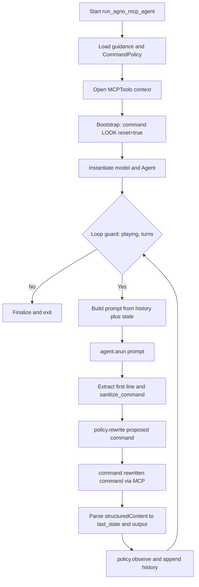
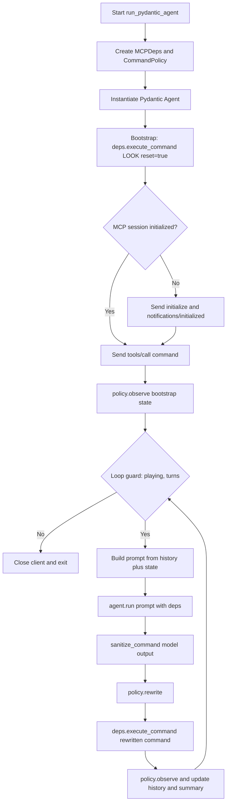
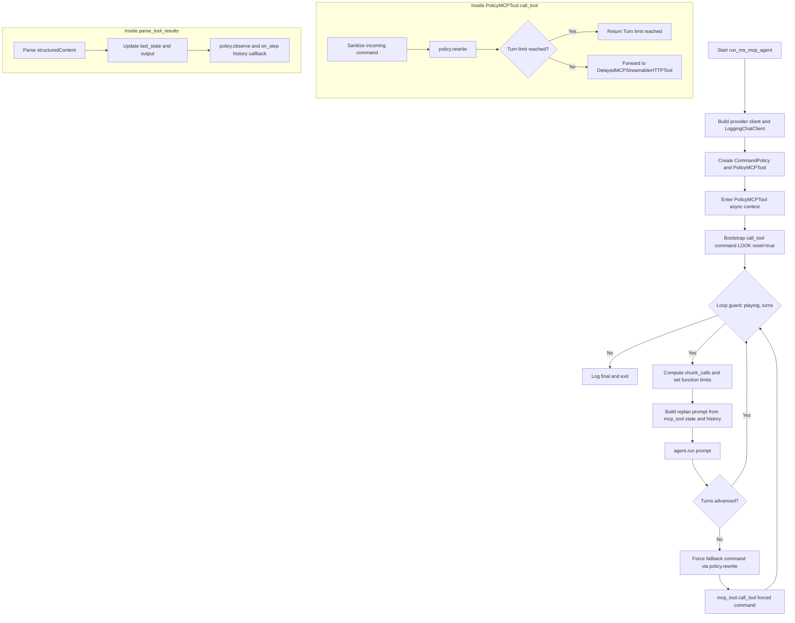
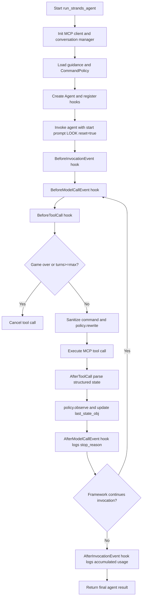

# Execution Flow and Logic in MCP Clients

This document complements `OBSERVABILITY.md` by focusing on **execution flow and decision logic** across MCP clients in `scripts/`.
It describes where control decisions are made (loop, tool boundary, or hooks), where state is updated, and where termination is enforced.

## High-Level Architectural Summary

The MCP clients in this project cluster into three practical patterns for managing LLM-to-game interaction:

1. **Loop-Centric (Procedural)**: `agno_mcp_client.py`, `pydantic_mcp_client.py`
- **Center of gravity**: Explicit `while` loop in the run function.
- **Logic shape**: Prompt construction, model invocation, command extraction, policy rewrite, and state updates are handled step-by-step in one loop.

2. **Hybrid Loop + Tool-Boundary Governance**: `ms_agent_mcp_client.py`
- **Center of gravity**: Outer replanning loop plus a strong tool boundary (`PolicyMCPTool.call_tool` / `_parse_tool_results`).
- **Logic shape**: High-level planning happens in replans, while command sanitization, policy rewrite, and turn-limit checks are enforced at tool execution time.

3. **Event-Centric (Reactive)**: `strands_mcp_client.py`
- **Center of gravity**: Framework lifecycle hooks.
- **Logic shape**: No explicit Python game `while` loop; policy and state transitions are injected at hook boundaries (`BeforeToolCall`, `AfterToolCall`, model/invocation hooks).

## Purpose and Scope

This analysis compares how each client:
- Orchestrates the game loop
- Decides the next command
- Applies policy rewrites and loop-breaking
- Updates state and history
- Terminates execution

This document is intentionally about **control flow and logic boundaries**, not telemetry schema design.

## Cross-Client Flow Matrix

| Dimension | Agno MCP | Pydantic AI MCP | MS Agent MCP | Strands MCP |
| :--- | :--- | :--- | :--- | :--- |
| Orchestration style | Explicit async while-loop | Explicit async while-loop with deps object | Hybrid replanning loop + tool-boundary controls | Event/hook-driven invocation lifecycle |
| Main control loop owner | `run_agno_mcp_agent` | `run_pydantic_agent` | `run_ms_mcp_agent` | Framework agent invocation; behavior shaped by hooks |
| Command normalization point | Loop: sanitize model text before rewrite | Loop: sanitize model output before rewrite | Tool boundary in `PolicyMCPTool.call_tool` | `BeforeToolCall` hook rewrites `event.tool_use["input"]` |
| Policy rewrite point | Loop (`policy.rewrite(...)`) | Loop (`policy.rewrite(...)`) | Tool boundary (`PolicyMCPTool.call_tool`) | Hook boundary (`_before_tool_call`) |
| Policy observe/update point | After each command result in loop | After each command result in loop | In tool result parser (`_parse_tool_results`) | `AfterToolCall` hook after structured result parse |
| Bootstrap behavior | Calls `command("LOOK", reset=True)` | Calls `deps.execute_command("LOOK", reset=True)` | Calls `mcp_tool.call_tool("command", ..., reset=True)` | Initial prompt instructs first tool call as `LOOK` with reset |
| Turn-limit enforcement | Loop condition + policy rewrite behavior | Loop condition + policy rewrite behavior | Guard in tool wrapper (`return "Turn limit reached."`) | Tool cancellation in `BeforeToolCall` hook |
| Non-progress handling | Relies on `CommandPolicy` rewrite/loop breaker | Relies on `CommandPolicy` rewrite/loop breaker | Extra deterministic fallback if turns did not advance | Primarily policy rewrite in hook; no explicit forced fallback loop |
| State source of truth | `last_state` + `last_output_text` in run scope | `current_res.state` + deps result | `mcp_tool.last_state` + `mcp_tool.last_output_text` | `last_state_obj` + `last_output_text` updated in hook |
| Termination conditions | Game ended, turn cap, or LLM-call cap | Game ended/final score, turn cap, or LLM-call cap | Game ended, turn cap, or LLM-call cap | Agent call returns/throws; tool calls can be canceled on game end/turn cap |

## Per-Client Execution Flows

### 1) Agno MCP Flow

1. Startup/bootstrap
- Load guidance, init `CommandPolicy`, set `max_llm_calls`, open `MCPTools` context.
- **Model and `Agent` are instantiated after the bootstrap `LOOK`**, not before: bootstrap runs first so the initial room state is available before entering the loop.

2. First command/session initialization
- Local async `command(...)` sends MCP `command` call.
- Bootstrap state with `command("LOOK", reset=True)` and `policy.observe(...)`.

3. Prompt construction and model invocation
- Build prompt from recent history + current state summary + remaining turns.
- Run model via `agent.arun(prompt)`.

4. Command extraction/sanitization
- Extract first line from model output, strip code fences, run `sanitize_command(...)`.

5. Policy rewrite gate
- Apply `policy.rewrite(proposed_command=raw_cmd, state=last_state, max_turns=...)`.

6. Tool execution and state update
- Execute rewritten command through local `command(...)`.
- Parse structured content into `last_state`/`last_output_text`.
- Update policy/history with executed command and resulting state.

7. Loop termination/fallback
- Stop on `is_playing == False`, `turns >= max_turns`, or `llm_calls >= max_llm_calls`.
- No extra deterministic post-step forced move; depends on policy loop-break rewrite.

Why it matters:
- Agno keeps policy at the loop level, so model output is explicitly transformed before any tool call.

### 2) Pydantic AI MCP Flow

1. Startup/bootstrap
- Create `MCPDeps`, load guidance, init `CommandPolicy`, instantiate `Agent`.

2. First command/session initialization
- `MCPDeps.execute_command(...)` lazily initializes MCP session (`initialize` + `notifications/initialized`) then calls `tools/call`.
- Bootstrap with `LOOK` reset and observe with policy.

3. Prompt construction and model invocation
- Build prompt from history + current state summary + remaining turns.
- Run provider via `agent.run(prompt, deps=deps)`.

4. Command extraction/sanitization
- Read `result.output`, sanitize with `sanitize_command(...)`.

5. Policy rewrite gate
- Apply `policy.rewrite(...)` in the main loop using `current_res.state`.

6. Tool execution and state update
- Execute through `deps.execute_command(next_cmd)`.
- Parse result into `CommandOutput`, then `policy.observe(...)`, update history/state summary.

7. Loop termination/fallback
- Stop on game end/final score marker, turn cap, or LLM-call cap.
- No separate deterministic fallback branch after each step.

Why it matters:
- Pydantic centralizes MCP session protocol details in dependencies, while keeping decision policy in the outer loop.

### 3) MS Agent MCP Flow

1. Startup/bootstrap
- Build provider client (wrapped by `LoggingChatClient`), init `CommandPolicy`, create `PolicyMCPTool`.

2. First command/session initialization
- Enter `PolicyMCPTool` async context.
- Start with `mcp_tool.call_tool("command", command="LOOK", reset=True)`.

3. Prompt construction and model invocation
- Outer while-loop performs replans.
- For each replan, compute `chunk_calls`, set function-call limits, compose prompt from tool-held state/history.
- Invoke `agent.run(prompt)` for multi-call chunks.

4. Command extraction/sanitization
- Not primarily loop-based; command normalization happens inside `PolicyMCPTool.call_tool`.

5. Policy rewrite gate
- In `PolicyMCPTool.call_tool`, sanitize + rewrite each `command` call before forwarding.
- Turn limit is also enforced here before dispatch.
- **Edge case**: when `last_state is None` (bootstrap call), `policy.rewrite` is skipped; the raw sanitized command (or `"LOOK"`) is used directly.
- **Double-rewrite on non-progress fallback**: the outer loop calls `policy.rewrite("LOOK", ...)` to produce the forced command, then passes it to `mcp_tool.call_tool`, which calls `policy.rewrite` a second time inside `PolicyMCPTool.call_tool`. Both rewrites are effectively idempotent in practice but the chain is worth knowing.

6. Tool execution and state update
- `DelayedMCPStreamableHTTPTool.call_tool` executes underlying MCP call.
- `PolicyMCPTool._parse_tool_results` parses structured content, updates `last_state`/`last_output_text`, and calls `policy.observe(...)`.

7. Loop termination/fallback
- Stop on game end, turn cap, or LLM-call cap.
- If turns did not advance after a replan, force one deterministic command via policy-rewritten fallback.

Why it matters:
- MS Agent moves command governance to the tool boundary, so every tool call is centrally constrained regardless of model response shape.

### 4) Strands MCP Flow

> **Note**: `run_strands_agent` is a **synchronous** function (`def`, not `async def`). The Strands framework drives the event loop internally via its synchronous `agent(prompt)` call, unlike the other three clients which are all `async def` and driven by `asyncio.run`.

1. Startup/bootstrap
- Initialize MCP transport client (stdio, SSE, or streamable-http), conversation manager (`SlidingWindowConversationManager`), `CommandPolicy`, and agent with hooks.

2. First command/session initialization
- Single top-level prompt instructs first tool call as `command='LOOK', reset=True`.
- Framework invocation drives subsequent model/tool steps.

3. Prompt construction and model invocation
- Prompt is static at entry; iterative control occurs through framework lifecycle and tool results.
- `BeforeModelCallEvent` timestamps each model call; `AfterModelCallEvent` logs per-call latency and `stop_reason`.

4. Command extraction/sanitization
- Happens in `BeforeToolCall` hook by inspecting tool input and sanitizing `command`.

5. Policy rewrite gate
- `BeforeToolCall` rewrites command via `policy.rewrite(...)`.
- Same hook can cancel tool when game ended or turn limit reached.

6. Tool execution and state update
- `AfterToolCall` parses structured result into `last_state_obj`/`last_output_text`.
- Calls `policy.observe(...)` using executed command and resulting state.

7. Loop termination/fallback
- Tool calls are canceled at boundary for end-state/turn-cap.
- No explicit outer while-loop fallback branch analogous to MS forced move.

Why it matters:
- Strands treats control as lifecycle events, so policy and state transitions are mediated by hooks rather than an explicit Python loop.

## Cross-Client Logic Contrasts

- **Policy boundary placement**:
  Loop-level in Agno/Pydantic vs tool-boundary/hook-level in MS/Strands.

- **State ownership model**:
  Agno/Pydantic keep state in loop variables; MS/Strands keep state near tool adapters/hooks.

- **Non-progress strategy**:
  MS adds explicit deterministic recovery when turns stall; others rely mainly on policy rewrite behavior.

- **Protocol responsibility**:
  Pydantic explicitly owns raw MCP initialize/notification flow in client deps; others rely on framework MCP adapters.

## Invariants and Risk Points

Invariants to preserve across clients:
- Command should be sanitized before hitting MCP `command` execution.
- Policy rewrite should run before non-reset game commands.
- Policy observe should run after successful stateful command execution.
- Turn cap should be enforceable even if model keeps requesting actions.

Risk points to monitor in future analysis:
- Divergence when no `structuredContent` is returned (state may lag).
- Different non-progress handling can produce materially different trajectories.
- Hook/tool-boundary rewrites can be harder to reason about than explicit loop transforms.
- Prompt/history window differences can change command quality independently of policy.
