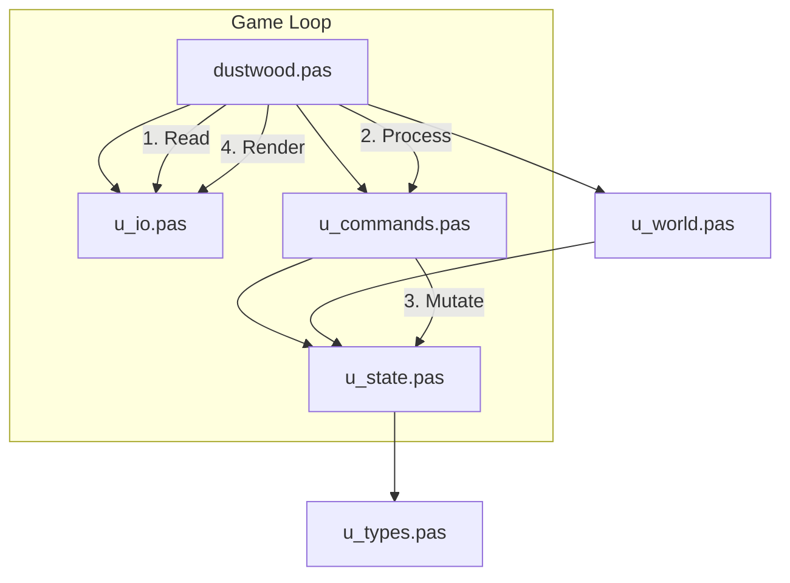
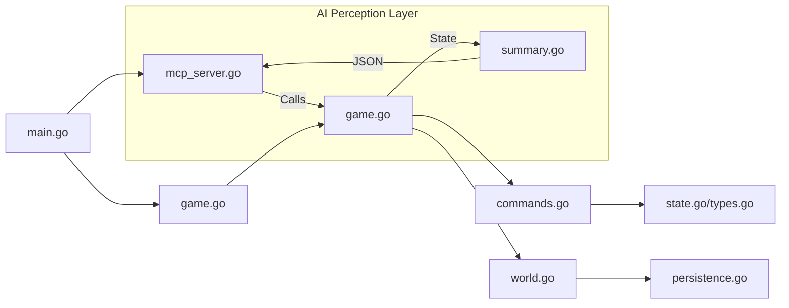

# Echoes of Dustwood: Mirror-Engine Architecture

This project implements a single game experience—*Echoes of Dustwood*—across two distinct technical stacks: **Free Pascal** and **Go**. The goal is to bridge the gap between retro-computing (Pascal) and modern AI integration (Go with MCP).

## Core Philosophy: Logic Parity
The Pascal engine serves as the "Reference Implementation." Every mechanic, from deterministic map randomization to thirst calculation, is mirrored in the Go codebase. This allows developers to prototype retro features in Pascal and deploy AI-optimized services in Go using the same underlying `world.ini`.

---

## 1. Shared World Definition (`data/world.ini`)
Both engines load the game world from a central INI file. This externalization allows for rapid map expansion without recompiling.
*   **Rooms**: ID-based entries with descriptions and directional links.
*   **Items**: Descriptions, starting locations, and functional properties (e.g., `is_container`).
*   **Connectivity**: N/S/E/W/U/D exits mapping to target Room IDs.

---

## 2. Pascal Engine Architecture (`src/pascal/`)
A modular, procedural implementation written in Free Pascal (FPC).

### Module Breakdown
*   **`dustwood.pas`**: Entry point. Manages the main `while State.IsPlaying` loop and CLI flag parsing.
*   **`u_types.pas`**: Data definitions. Contains `TGameState`, `TRoom`, and `TItem` records.
*   **`u_state.pas`**: State lifecycle. Functions like `InitState` and `ResetState`.
*   **`u_world.pas`**: The Logic Heart. Contains `LoadWorld` (INI parser) and `MovePlayer`.
*   **`u_commands.pas`**: Command Dispatcher. Contains `ProcessCommand` and all verb implementations (`DoTake`, `DoLook`, etc.).
*   **`u_io.pas`**: I/O Abstraction. Handles `CustomReadLn` and `WriteWrapped` for terminal consistency.

---

## 3. Go Engine Architecture (`src/golang/`)
A modern, concurrent implementation designed for high-performance AI services.

### Module Breakdown
*   **`main.go`**: Multi-mode entry. Routes execution to either `RunTerminalGame` or `RunMCP`.
*   **`game.go`**: Core engine instance. Manages the `GameState` struct and turn-based progression.
*   **`commands.go`**: Verb logic. Refined version of the Pascal command processor using string switches.
*   **`world.go`**: World management. Implements the INI loader and spatial navigation.
*   **`mcp_server.go`**: The API Layer. Wraps the engine in a Model Context Protocol server.
*   **`summary.go`**: State Export. Translates internal Go pointers into flat JSON `GameSummary` objects.
*   **`persistence.go`**: Disk I/O. Handles `data/world.ini` loading and JSON save-game compatibility.

---

## 4. AI Integration Layer (`scripts/`)
The "Brain" of the project, communicating with the engines via Sidecars or MCP.
*   **Legacy Path (`sidecar.py`)**: A FastAPI wrapper that manages a long-running Pascal/Go subprocess and redirects I/O.
*   **Modern Path (`strands_mcp_client.py`)**: Uses the Model Context Protocol to treat the Go engine as a set of structured tools.
*   **The "Frustration" Mechanic**: Shared logic across clients that detects stagnant game states and triggers "Reset" or "Burn" commands to break agent loops.
*   **Augmented Reality (AR) Context**: Injecting state-tracking data (from `GameSummary`) into LLM prompts to prevent hallucination during movement and item interaction.

---

## 5. Development Workflow
*   **Make Build**: Use the `Makefile` to compile both binaries:
    *   `bin/dustwood` (Pascal)
    *   `bin/dustwood-go` (Go)
*   **Parity Testing**: Use `model_tester.sh` to run the same LLM against both engines to verify logic consistency.
